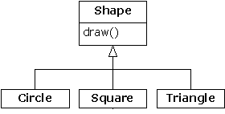

# 11.1 对RTTI的需要


请考虑下面这个熟悉的类结构例子，它利用了多形性。常规类型是Shape类，而特别衍生出来的类型是Circle，Square和Triangle。



这是一个典型的类结构示意图，基础类位于顶部，衍生类向下延展。面向对象编程的基本目标是用大量代码控制基础类型（这里是Shape）的句柄，所以假如决定添加一个新类（比如Rhomboid，从Shape衍生），从而对程序进行扩展，那么不会影响到原来的代码。在这个例子中，Shape接口中的动态绑定方法是draw()，所以客户程序员要做的是通过一个普通Shape句柄调用draw()。draw()在所有衍生类里都会被覆盖。而且由于它是一个动态绑定方法，所以即使通过一个普通的Shape句柄调用它，也有表现出正确的行为。这正是多形性的作用。

所以，我们一般创建一个特定的对象（Circle，Square，或者Triangle），把它上溯造型到一个Shape（忽略对象的特殊类型），以后便在程序的剩余部分使用匿名Shape句柄。

作为对多形性和上溯造型的一个简要回顾，可以象下面这样为上述例子编码（若执行这个程序时出现困难，请参考第3章3.1.2小节“赋值”）：

```
//: Shapes.java
package c11;
import java.util.*;

interface Shape {
  void draw();
}

class Circle implements Shape {
  public void draw() {
    System.out.println("Circle.draw()");
  }
}

class Square implements Shape {
  public void draw() {
    System.out.println("Square.draw()");
  }
}

class Triangle implements Shape {
  public void draw() {
    System.out.println("Triangle.draw()");
  }
}

public class Shapes {
  public static void main(String[] args) {
    Vector s = new Vector();
    s.addElement(new Circle());
    s.addElement(new Square());
    s.addElement(new Triangle());
    Enumeration e = s.elements();
    while(e.hasMoreElements())
      ((Shape)e.nextElement()).draw();
  }
} ///:~
```

基础类可编码成一个interface（接口）、一个abstract（抽象）类或者一个普通类。由于Shape没有真正的成员（亦即有定义的成员），而且并不在意我们创建了一个纯粹的Shape对象，所以最适合和最灵活的表达方式便是用一个接口。而且由于不必设置所有那些abstract关键字，所以整个代码也显得更为清爽。

每个衍生类都覆盖了基础类draw方法，所以具有不同的行为。在main()中创建了特定类型的Shape，然后将其添加到一个Vector。这里正是上溯造型发生的地方，因为Vector只容纳了对象。由于Java中的所有东西（除基本数据类型外）都是对象，所以Vector也能容纳Shape对象。但在上溯造型至Object的过程中，任何特殊的信息都会丢失，其中甚至包括对象是几何形状这一事实。对Vector来说，它们只是Object。

用nextElement()将一个元素从Vector提取出来的时候，情况变得稍微有些复杂。由于Vector只容纳Object，所以nextElement()会自然地产生一个Object句柄。但我们知道它实际是个Shape句柄，而且希望将Shape消息发给那个对象。所以需要用传统的"(Shape)"方式造型成一个Shape。这是RTTI最基本的形式，因为在Java中，所有造型都会在运行期间得到检查，以确保其正确性。那正是RTTI的意义所在：在运行期，对象的类型会得到鉴定。

在目前这种情况下，RTTI造型只实现了一部分：Object造型成Shape，而不是造型成Circle，Square或者Triangle。那是由于我们目前能够肯定的唯一事实就是Vector里充斥着几何形状，而不知它们的具体类别。在编译期间，我们肯定的依据是我们自己的规则；而在编译期间，却是通过造型来肯定这一点。

现在的局面会由多形性控制，而且会为Shape调用适当的方法，以便判断句柄到底是提供Circle，Square，还是提供给Triangle。而且在一般情况下，必须保证采用多形性方案。因为我们希望自己的代码尽可能少知道一些与对象的具体类型有关的情况，只将注意力放在某一类对象（这里是Shape）的常规信息上。只有这样，我们的代码才更易实现、理解以及修改。所以说多形性是面向对象程序设计的一个常规目标。

然而，若碰到一个特殊的程序设计问题，只有在知道常规句柄的确切类型后，才能最容易地解决这个问题，这个时候又该怎么办呢？举个例子来说，我们有时候想让自己的用户将某一具体类型的几何形状（如三角形）全都变成紫色，以便突出显示它们，并快速找出这一类型的所有形状。此时便要用到RTTI技术，用它查询某个Shape句柄引用的准确类型是什么。

11.1.1 Class对象

为理解RTTI在Java里如何工作，首先必须了解类型信息在运行期是如何表示的。这时要用到一个名为“Class对象”的特殊形式的对象，其中包含了与类有关的信息（有时也把它叫作“元类”）。事实上，我们要用Class对象创建属于某个类的全部“常规”或“普通”对象。

对于作为程序一部分的每个类，它们都有一个Class对象。换言之，每次写一个新类时，同时也会创建一个Class对象（更恰当地说，是保存在一个完全同名的.class文件中）。在运行期，一旦我们想生成那个类的一个对象，用于执行程序的Java虚拟机（JVM）首先就会检查那个类型的Class对象是否已经载入。若尚未载入，JVM就会查找同名的.class文件，并将其载入。所以Java程序启动时并不是完全载入的，这一点与许多传统语言都不同。

一旦那个类型的Class对象进入内存，就用它创建那一类型的所有对象。

若这种说法多少让你产生了一点儿迷惑，或者并没有真正理解它，下面这个示范程序或许能提供进一步的帮助：

```
//: SweetShop.java
// Examination of the way the class loader works

class Candy {
  static {
    System.out.println("Loading Candy");
  }
}

class Gum {
  static {
    System.out.println("Loading Gum");
  }
}

class Cookie {
  static {
    System.out.println("Loading Cookie");
  }
}

public class SweetShop {
  public static void main(String[] args) {
    System.out.println("inside main");
    new Candy();
    System.out.println("After creating Candy");
    try {
      Class.forName("Gum");
    } catch(ClassNotFoundException e) {
      e.printStackTrace();
    }
    System.out.println(
      "After Class.forName(\"Gum\")");
    new Cookie();
    System.out.println("After creating Cookie");
  }
} ///:~
```

对每个类来说（Candy，Gum和Cookie），它们都有一个static从句，用于在类首次载入时执行。相应的信息会打印出来，告诉我们载入是什么时候进行的。在main()中，对象的创建代码位于打印语句之间，以便侦测载入时间。
特别有趣的一行是：

```
Class.forName("Gum");
```

该方法是Class（即全部Class所从属的）的一个static成员。而Class对象和其他任何对象都是类似的，所以能够获取和控制它的一个句柄（装载模块就是干这件事的）。为获得Class的一个句柄，一个办法是使用forName()。它的作用是取得包含了目标类文本名字的一个String（注意拼写和大小写）。最后返回的是一个Class句柄。

该程序在某个JVM中的输出如下：

```
inside main
Loading Candy
After creating Candy
Loading Gum
After Class.forName("Gum")
Loading Cookie
After creating Cookie
```

可以看到，每个Class只有在它需要的时候才会载入，而static初始化工作是在类载入时执行的。
非常有趣的是，另一个JVM的输出变成了另一个样子：

```
Loading Candy
Loading Cookie
inside main
After creating Candy
Loading Gum
After Class.forName("Gum")
After creating Cookie
```

看来JVM通过检查main()中的代码，已经预测到了对Candy和Cookie的需要，但却看不到Gum，因为它是通过对forName()的一个调用创建的，而不是通过更典型的new调用。尽管这个JVM也达到了我们希望的效果，因为确实会在我们需要之前载入那些类，但却不能肯定这儿展示的行为百分之百正确。

1. 类标记

在Java 1.1中，可以采用第二种方式来产生Class对象的句柄：使用“类标记”。对上述程序来说，看起来就象下面这样：
Gum.class;

这样做不仅更加简单，而且更安全，因为它会在编译期间得到检查。由于它取消了对方法调用的需要，所以执行的效率也会更高。
类标记不仅可以应用于普通类，也可以应用于接口、数组以及基本数据类型。除此以外，针对每种基本数据类型的封装器类，它还存在一个名为TYPE的标准字段。TYPE字段的作用是为相关的基本数据类型产生Class对象的一个句柄，如下所示：

……等价于……

```
... is equivalent to ...
boolean.class

Boolean.TYPE

char.class

Character.TYPE

byte.class

Byte.TYPE

short.class

Short.TYPE

int.class

Integer.TYPE

long.class

Long.TYPE

float.class

Float.TYPE

double.class

Double.TYPE

void.class

Void.TYPE

```

11.1.2 造型前的检查

迄今为止，我们已知的RTTI形式包括：

(1) 经典造型，如"(Shape)"，它用RTTI确保造型的正确性，并在遇到一个失败的造型后产生一个ClassCastException违例。

(2) 代表对象类型的Class对象。可查询Class对象，获取有用的运行期资料。

在C++中，经典的"(Shape)"造型并不执行RTTI。它只是简单地告诉编译器将对象当作新类型处理。而Java要执行类型检查，这通常叫作“类型安全”的下溯造型。之所以叫“下溯造型”，是由于类分层结构的历史排列方式造成的。若将一个Circle（圆）造型到一个Shape（几何形状），就叫做上溯造型，因为圆只是几何形状的一个子集。反之，若将Shape造型至Circle，就叫做下溯造型。然而，尽管我们明确知道Circle也是一个Shape，所以编译器能够自动上溯造型，但却不能保证一个Shape肯定是一个Circle。因此，编译器不允许自动下溯造型，除非明确指定一次这样的造型。

RTTI在Java中存在三种形式。关键字instanceof告诉我们对象是不是一个特定类型的实例（Instance即“实例”）。它会返回一个布尔值，以便以问题的形式使用，就象下面这样：

```
if(x instanceof Dog)
((Dog)x).bark();
```

将x造型至一个Dog前，上面的if语句会检查对象x是否从属于Dog类。进行造型前，如果没有其他信息可以告诉自己对象的类型，那么instanceof的使用是非常重要的——否则会得到一个ClassCastException违例。

我们最一般的做法是查找一种类型（比如要变成紫色的三角形），但下面这个程序却演示了如何用instanceof标记出所有对象。

```
//: PetCount.java
// Using instanceof
package c11.petcount;
import java.util.*;

class Pet {}
class Dog extends Pet {}
class Pug extends Dog {}
class Cat extends Pet {}
class Rodent extends Pet {}
class Gerbil extends Rodent {}
class Hamster extends Rodent {}

class Counter { int i; }

public class PetCount {
  static String[] typenames = {
    "Pet", "Dog", "Pug", "Cat",
    "Rodent", "Gerbil", "Hamster",
  };
  public static void main(String[] args) {
    Vector pets = new Vector();
    try {
      Class[] petTypes = {
        Class.forName("c11.petcount.Dog"),
        Class.forName("c11.petcount.Pug"),
        Class.forName("c11.petcount.Cat"),
        Class.forName("c11.petcount.Rodent"),
        Class.forName("c11.petcount.Gerbil"),
        Class.forName("c11.petcount.Hamster"),
      };
      for(int i = 0; i < 15; i++)
        pets.addElement(
          petTypes[
            (int)(Math.random()*petTypes.length)]
            .newInstance());
    } catch(InstantiationException e) {}
      catch(IllegalAccessException e) {}
      catch(ClassNotFoundException e) {}
    Hashtable h = new Hashtable();
    for(int i = 0; i < typenames.length; i++)
      h.put(typenames[i], new Counter());
    for(int i = 0; i < pets.size(); i++) {
      Object o = pets.elementAt(i);
      if(o instanceof Pet)
        ((Counter)h.get("Pet")).i++;
      if(o instanceof Dog)
        ((Counter)h.get("Dog")).i++;
      if(o instanceof Pug)
        ((Counter)h.get("Pug")).i++;
      if(o instanceof Cat)
        ((Counter)h.get("Cat")).i++;
      if(o instanceof Rodent)
        ((Counter)h.get("Rodent")).i++;
      if(o instanceof Gerbil)
        ((Counter)h.get("Gerbil")).i++;
      if(o instanceof Hamster)
        ((Counter)h.get("Hamster")).i++;
    }
    for(int i = 0; i < pets.size(); i++)
      System.out.println(
        pets.elementAt(i).getClass().toString());
    for(int i = 0; i < typenames.length; i++)
      System.out.println(
        typenames[i] + " quantity: " +
        ((Counter)h.get(typenames[i])).i);
  }
} ///:~
```

在Java 1.0中，对instanceof有一个比较小的限制：只可将其与一个已命名的类型比较，不能同Class对象作对比。在上述例子中，大家可能觉得将所有那些instanceof表达式写出来是件很麻烦的事情。实际情况正是这样。但在Java 1.0中，没有办法让这一工作自动进行——不能创建Class的一个Vector，再将其与之比较。大家最终会意识到，如编写了数量众多的instanceof表达式，整个设计都可能出现问题。

当然，这个例子只是一个构想——最好在每个类型里添加一个static数据成员，然后在构建器中令其增值，以便跟踪计数。编写程序时，大家可能想象自己拥有类的源码控制权，能够自由改动它。但由于实际情况并非总是这样，所以RTTI显得特别方便。

1. 使用类标记

PetCount.java示例可用Java 1.1的类标记重写一遍。得到的结果显得更加明确易懂：

```
//: PetCount2.java
// Using Java 1.1 class literals
package c11.petcount2;
import java.util.*;

class Pet {}
class Dog extends Pet {}
class Pug extends Dog {}
class Cat extends Pet {}
class Rodent extends Pet {}
class Gerbil extends Rodent {}
class Hamster extends Rodent {}

class Counter { int i; }

public class PetCount2 {
  public static void main(String[] args) {
    Vector pets = new Vector();
    Class[] petTypes = {
      // Class literals work in Java 1.1+ only:
      Pet.class,
      Dog.class,
      Pug.class,
      Cat.class,
      Rodent.class,
      Gerbil.class,
      Hamster.class,
    };
    try {
      for(int i = 0; i < 15; i++) {
        // Offset by one to eliminate Pet.class:
        int rnd = 1 + (int)(
          Math.random() * (petTypes.length - 1));
        pets.addElement(
          petTypes[rnd].newInstance());
      }
    } catch(InstantiationException e) {}
      catch(IllegalAccessException e) {}
    Hashtable h = new Hashtable();
    for(int i = 0; i < petTypes.length; i++)
      h.put(petTypes[i].toString(),
        new Counter());
    for(int i = 0; i < pets.size(); i++) {
      Object o = pets.elementAt(i);
      if(o instanceof Pet)
        ((Counter)h.get(
          "class c11.petcount2.Pet")).i++;
      if(o instanceof Dog)
        ((Counter)h.get(
          "class c11.petcount2.Dog")).i++;
      if(o instanceof Pug)
        ((Counter)h.get(
          "class c11.petcount2.Pug")).i++;
      if(o instanceof Cat)
        ((Counter)h.get(
          "class c11.petcount2.Cat")).i++;
      if(o instanceof Rodent)
        ((Counter)h.get(
          "class c11.petcount2.Rodent")).i++;
      if(o instanceof Gerbil)
        ((Counter)h.get(
          "class c11.petcount2.Gerbil")).i++;
      if(o instanceof Hamster)
        ((Counter)h.get(
          "class c11.petcount2.Hamster")).i++;
    }
    for(int i = 0; i < pets.size(); i++)
      System.out.println(
        pets.elementAt(i).getClass().toString());
    Enumeration keys = h.keys();
    while(keys.hasMoreElements()) {
      String nm = (String)keys.nextElement();
      Counter cnt = (Counter)h.get(nm);
      System.out.println(
        nm.substring(nm.lastIndexOf('.') + 1) + 
        " quantity: " + cnt.i);
    }
  }
} ///:~
```

在这里，typenames（类型名）数组已被删除，改为从Class对象里获取类型名称。注意为此而额外做的工作：例如，类名不是Getbil，而是c11.petcount2.Getbil，其中已包含了包的名字。也要注意系统是能够区分类和接口的。

也可以看到，petTypes的创建模块不需要用一个try块包围起来，因为它会在编译期得到检查，不会象Class.forName()那样“掷”出任何违例。

Pet动态创建好以后，可以看到随机数字已得到了限制，位于1和petTypes.length之间，而且不包括零。那是由于零代表的是Pet.class，而且一个普通的Pet对象可能不会有人感兴趣。然而，由于Pet.class是petTypes的一部分，所以所有Pet（宠物）都会算入计数中。

2. 动态的instanceof


Java 1.1为Class类添加了isInstance方法。利用它可以动态调用instanceof运算符。而在Java 1.0中，只能静态地调用它（就象前面指出的那样）。因此，所有那些烦人的instanceof语句都可以从PetCount例子中删去了。如下所示：

```
//: PetCount3.java
// Using Java 1.1 isInstance()
package c11.petcount3;
import java.util.*;

class Pet {}
class Dog extends Pet {}
class Pug extends Dog {}
class Cat extends Pet {}
class Rodent extends Pet {}
class Gerbil extends Rodent {}
class Hamster extends Rodent {}

class Counter { int i; }

public class PetCount3 {
  public static void main(String[] args) {
    Vector pets = new Vector();
    Class[] petTypes = {
      Pet.class,
      Dog.class,
      Pug.class,
      Cat.class,
      Rodent.class,
      Gerbil.class,
      Hamster.class,
    };
    try {
      for(int i = 0; i < 15; i++) {
        // Offset by one to eliminate Pet.class:
        int rnd = 1 + (int)(
          Math.random() * (petTypes.length - 1));
        pets.addElement(
          petTypes[rnd].newInstance());
      }
    } catch(InstantiationException e) {}
      catch(IllegalAccessException e) {}
    Hashtable h = new Hashtable();
    for(int i = 0; i < petTypes.length; i++)
      h.put(petTypes[i].toString(),
        new Counter());
    for(int i = 0; i < pets.size(); i++) {
      Object o = pets.elementAt(i);
      // Using isInstance to eliminate individual
      // instanceof expressions:
      for (int j = 0; j < petTypes.length; ++j)
        if (petTypes[j].isInstance(o)) {
          String key = petTypes[j].toString();
          ((Counter)h.get(key)).i++;
        }
    }
    for(int i = 0; i < pets.size(); i++)
      System.out.println(
        pets.elementAt(i).getClass().toString());
    Enumeration keys = h.keys();
    while(keys.hasMoreElements()) {
      String nm = (String)keys.nextElement();
      Counter cnt = (Counter)h.get(nm);
      System.out.println(
        nm.substring(nm.lastIndexOf('.') + 1) + 
        " quantity: " + cnt.i);
    }
  }
} ///:~
```

可以看到，Java 1.1的isInstance()方法已取消了对instanceof表达式的需要。此外，这也意味着一旦要求添加新类型宠物，只需简单地改变petTypes数组即可；毋需改动程序剩余的部分（但在使用instanceof时却是必需的）。
