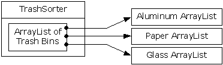
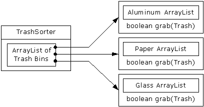

# 16.5 抽象的应用

走到这一步，接下来该考虑一下设计方案剩下的部分了——在哪里使用类？既然归类到垃圾箱的办法非常不雅且过于暴露，为什么不隔离那个过程，把它隐藏到一个类里呢？这就是著名的“如果必须做不雅的事情，至少应将其本地化到一个类里”规则。看起来就象下面这样：


 
现在，只要一种新类型的Trash加入方法，对TrashSorter对象的初始化就必须变动。可以想象，TrashSorter类看起来应该象下面这个样子：

```
class TrashSorter extends Vector {
void sort(Trash t) { /* ... */ }
}
```

也就是说，TrashSorter是由一系列句柄构成的Vector（系列），而那些句柄指向的又是由Trash句柄构成的Vector；利用addElement()，可以安装新的TrashSorter，如下所示：

```
TrashSorter ts = new TrashSorter();
ts.addElement(new Vector());
```

但是现在，sort()却成为一个问题。用静态方式编码的方法如何应付一种新类型加入的事实呢？为解决这个问题，必须从sort()里将类型信息删除，使其需要做的所有事情就是调用一个通用方法，用它照料涉及类型处理的所有细节。这当然是对一个动态绑定方法进行描述的另一种方式。所以sort()会在序列中简单地遍历，并为每个Vector都调用一个动态绑定方法。由于这个方法的任务是收集它感兴趣的垃圾片，所以称之为grab(Trash)。结构现在变成了下面这样：


 
其中，TrashSorter需要调用每个grab()方法；然后根据当前Vector容纳的是什么类型，会获得一个不同的结果。也就是说，Vector必须留意自己容纳的类型。解决这个问题的传统方法是创建一个基础“Trash bin”（垃圾筒）类，并为希望容纳的每个不同的类型都继承一个新的衍生类。若Java有一个参数化的类型机制，那就也许是最直接的方法。但对于这种机制应该为我们构建的各个类，我们不应该进行麻烦的手工编码，以后的“观察”方式提供了一种更好的编码方式。

OOP设计一条基本的准则是“为状态的变化使用数据成员，为行为的变化使用多性形”。对于容纳Paper（纸张）的Vector，以及容纳Glass（玻璃）的Vector，大家最开始或许会认为分别用于它们的grab()方法肯定会产生不同的行为。但具体如何却完全取决于类型，而不是其他什么东西。可将其解释成一种不同的状态，而且由于Java有一个类可表示类型（Class），所以可用它判断特定的Tbin要容纳什么类型的Trash。

用于Tbin的构建器要求我们为其传递自己选择的一个Class。这样做可告诉Vector它希望容纳的是什么类型。随后，grab()方法用Class BinType和RTTI来检查我们传递给它的Trash对象是否与它希望收集的类型相符。
下面列出完整的解决方案。设定为注释的编号（如*1*）便于大家对照程序后面列出的说明。

```
//: RecycleB.java
// Adding more objects to the recycling problem
package c16.recycleb;
import c16.trash.*;
import java.util.*;

// A vector that admits only the right type:
class Tbin extends Vector {
  Class binType;
  Tbin(Class binType) { 
    this.binType = binType; 
  }
  boolean grab(Trash t) {
    // Comparing class types:
    if(t.getClass().equals(binType)) {
      addElement(t);
      return true; // Object grabbed
    }
    return false; // Object not grabbed
  }
}

class TbinList extends Vector { //(*1*)
  boolean sort(Trash t) {
    Enumeration e = elements();
    while(e.hasMoreElements()) {
      Tbin bin = (Tbin)e.nextElement();
      if(bin.grab(t)) return true;
    }
    return false; // bin not found for t
  }
  void sortBin(Tbin bin) { // (*2*)
    Enumeration e = bin.elements();
    while(e.hasMoreElements())
      if(!sort((Trash)e.nextElement()))
        System.out.println("Bin not found");
  }
}

public class RecycleB {
  static Tbin bin = new Tbin(Trash.class);
  public static void main(String[] args) {
    // Fill up the Trash bin:
    ParseTrash.fillBin("Trash.dat", bin);

    TbinList trashBins = new TbinList();
    trashBins.addElement(
      new Tbin(Aluminum.class));
    trashBins.addElement(
      new Tbin(Paper.class));
    trashBins.addElement(
      new Tbin(Glass.class));
    // add one line here: (*3*)
    trashBins.addElement(
      new Tbin(Cardboard.class));

    trashBins.sortBin(bin); // (*4*)

    Enumeration e = trashBins.elements();
    while(e.hasMoreElements()) {
      Tbin b = (Tbin)e.nextElement();
      Trash.sumValue(b);
    }
    Trash.sumValue(bin);
  }
} ///:~
```

(1) TbinList容纳一系列Tbin句柄，所以在查找与我们传递给它的Trash对象相符的情况时，sort()能通过Tbin继承。

(2) sortBin()允许我们将一个完整的Tbin传递进去，而且它会在Tbin里遍历，挑选出每种Trash，并将其归类到特定的Tbin中。请注意这些代码的通用性：新类型加入时，它本身不需要任何改动。只要新类型加入（或发生其他事件）时大量代码都不需要变化，就表明我们设计的是一个容易扩展的系统。

(3) 现在可以体会添加新类型有多么容易了。为支持添加，只需要改动几行代码。如确实有必要，甚至可以进一步地改进设计，使更多的代码都保持“固定”。

(4) 一个方法调用使bin的内容归类到对应的、特定类型的垃圾筒里。
