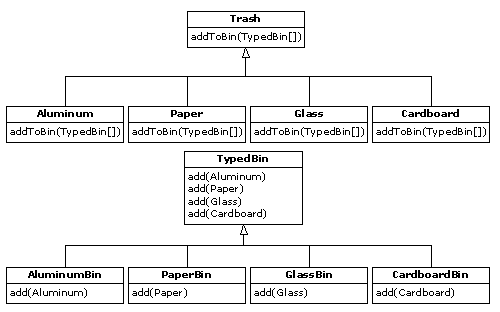

# 16.6 多重派遣

上述设计方案肯定是令人满意的。系统内新类型的加入涉及添加或修改不同的类，但没有必要在系统内对代码作大范围的改动。除此以外，RTTI并不象它在RecycleA.java里那样被不当地使用。然而，我们仍然有可能更深入一步，以最“纯”的角度来看待RTTI，
考虑如何在垃圾分类系统中将它完全消灭。

为达到这个目标，首先必须认识到：对所有与不同类型有特殊关联的活动来说——比如侦测一种垃圾的具体类型，并把它置入适当的垃圾筒里——这些活动都应当通过多形性以及动态绑定加以控制。

以前的例子都是先按类型排序，再对属于某种特殊类型的一系列元素进行操作。现在一旦需要操作特定的类型，就请先停下来想一想。事实上，多形性（动态绑定的方法调用）整个的宗旨就是帮我们管理与不同类型有特殊关联的信息。既然如此，为什么还要自己去检查类型呢？

答案在于大家或许不以为然的一个道理：Java只执行单一派遣。也就是说，假如对多个类型未知的对象执行某项操作，Java只会为那些类型中的一种调用动态绑定机制。这当然不能解决问题，所以最后不得不人工判断某些类型，才能有效地产生自己的动态绑定行为。

为解决这个缺陷，我们需要用到“多重派遣”机制，这意味着需要建立一个配置，使单一方法调用能产生多个动态方法调用，从而在一次处理过程中正确判断出多种类型。为达到这个要求，需要对多个类型结构进行操作：每一次派遣都需要一个类型结构。下面的例子将对两个结构进行操作：现有的Trash系列以及由垃圾筒（Trash Bin）的类型构成的一个系列——不同的垃圾或废品将置入这些筒内。第二个分级结构并非绝对显然的。在这种情况下，我们需要人为地创建它，以执行多重派遣（由于本例只涉及两次派遣，所以称为“双重派遣”）。

16.6.1 实现双重派遣

记住多形性只能通过方法调用才能表现出来，所以假如想使双重派遣正确进行，必须执行两个方法调用：在每种结构中都用一个来判断其中的类型。在Trash结构中，将使用一个新的方法调用addToBin()，它采用的参数是由TypeBin构成的一个数组。那个方法将在数组中遍历，尝试将自己加入适当的垃圾筒，这里正是双重派遣发生的地方。


 
新建立的分级结构是TypeBin，其中包含了它自己的一个方法，名为add()，而且也应用了多形性。但要注意一个新特点：add()已进行了“过载”处理，可接受不同的垃圾类型作为参数。因此，双重满足机制的一个关键点是它也要涉及到过载。
程序的重新设计也带来了一个问题：现在的基础类Trash必须包含一个addToBin()方法。为解决这个问题，一个最直接的办法是复制所有代码，并修改基础类。然而，假如没有对源码的控制权，那么还有另一个办法可以考虑：将addToBin()方法置入一个接口内部，保持Trash不变，并继承新的、特殊的类型Aluminum，Paper，Glass以及Cardboard。我们在这里准备采取后一个办法。
这个设计方案中用到的大多数类都必须设为public（公用）属性，所以它们放置于自己的类内。下面列出接口代码：

```
//: TypedBinMember.java
// An interface for adding the double dispatching
// method to the trash hierarchy without 
// modifying the original hierarchy.
package c16.doubledispatch;

interface TypedBinMember {
  // The new method:
  boolean addToBin(TypedBin[] tb);
} ///:~
```

在Aluminum，Paper，Glass以及Cardboard每个特定的子类型内，都会实现接口TypeBinMember的addToBin()方法，但每种情况下使用的代码“似乎”都是完全一样的：

```
//: DDAluminum.java
// Aluminum for double dispatching
package c16.doubledispatch;
import c16.trash.*;

public class DDAluminum extends Aluminum 
    implements TypedBinMember {
  public DDAluminum(double wt) { super(wt); }
  public boolean addToBin(TypedBin[] tb) {
    for(int i = 0; i < tb.length; i++)
      if(tb[i].add(this))
        return true;
    return false;
  }
} ///:~
//: DDPaper.java
// Paper for double dispatching
package c16.doubledispatch;
import c16.trash.*;

public class DDPaper extends Paper 
    implements TypedBinMember {
  public DDPaper(double wt) { super(wt); }
  public boolean addToBin(TypedBin[] tb) {
    for(int i = 0; i < tb.length; i++)
      if(tb[i].add(this))
        return true;
    return false;
  }
} ///:~
//: DDGlass.java
// Glass for double dispatching
package c16.doubledispatch;
import c16.trash.*;

public class DDGlass extends Glass 
    implements TypedBinMember {
  public DDGlass(double wt) { super(wt); }
  public boolean addToBin(TypedBin[] tb) {
    for(int i = 0; i < tb.length; i++)
      if(tb[i].add(this))
        return true;
    return false;
  }
} ///:~
//: DDCardboard.java
// Cardboard for double dispatching
package c16.doubledispatch;
import c16.trash.*;

public class DDCardboard extends Cardboard 
    implements TypedBinMember {
  public DDCardboard(double wt) { super(wt); }
  public boolean addToBin(TypedBin[] tb) {
    for(int i = 0; i < tb.length; i++)
      if(tb[i].add(this))
        return true;
    return false;
  }
} ///:~
```

每个addToBin()内的代码会为数组中的每个TypeBin对象调用add()。但请注意参数：this。对Trash的每个子类来说，this的类型都是不同的，所以不能认为代码“完全”一样——尽管以后在Java里加入参数化类型机制后便可认为一样。这是双重派遣的第一个部分，因为一旦进入这个方法内部，便可知道到底是Aluminum，Paper，还是其他什么垃圾类型。在对add()的调用过程中，这种信息是通过this的类型传递的。编译器会分析出对add()正确的过载版本的调用。但由于tb[i]会产生指向基础类型TypeBin的一个句柄，所以最终会调用一个不同的方法——具体什么方法取决于当前选择的TypeBin的类型。那就是第二次派遣。

下面是TypeBin的基础类：

```
//: TypedBin.java
// Vector that knows how to grab the right type
package c16.doubledispatch;
import c16.trash.*;
import java.util.*;

public abstract class TypedBin {
  Vector v = new Vector();
  protected boolean addIt(Trash t) {
    v.addElement(t);
    return true;
  }
  public Enumeration elements() {
    return v.elements();
  }
  public boolean add(DDAluminum a) {
    return false;
  }
  public boolean add(DDPaper a) {
    return false;
  }
  public boolean add(DDGlass a) {
    return false;
  }
  public boolean add(DDCardboard a) {
    return false;
  }
} ///:~
```

可以看到，过载的add()方法全都会返回false。如果未在衍生类里对方法进行过载，它就会一直返回false，而且调用者（目前是addToBin()）会认为当前Trash对象尚未成功加入一个集合，所以会继续查找正确的集合。

在TypeBin的每一个子类中，都只有一个过载的方法会被过载——具体取决于准备创建的是什么垃圾筒类型。举个例子来说，CardboardBin会过载add(DDCardboard)。过载的方法会将垃圾对象加入它的集合，并返回true。而CardboardBin中剩余的所有add()方法都会继续返回false，因为它们尚未过载。事实上，假如在这里采用了参数化类型机制，Java代码的自动创建就要方便得多（使用C++的“模板”，我们不必费事地为子类编码，或者将addToBin()方法置入Trash里；Java在这方面尚有待改进）。

由于对这个例子来说，垃圾的类型已经定制并置入一个不同的目录，所以需要用一个不同的垃圾数据文件令其运转起来。下面是一个示范性的DDTrash.dat：

```
c16.DoubleDispatch.DDGlass:54
c16.DoubleDispatch.DDPaper:22
c16.DoubleDispatch.DDPaper:11
c16.DoubleDispatch.DDGlass:17
c16.DoubleDispatch.DDAluminum:89
c16.DoubleDispatch.DDPaper:88
c16.DoubleDispatch.DDAluminum:76
c16.DoubleDispatch.DDCardboard:96
c16.DoubleDispatch.DDAluminum:25
c16.DoubleDispatch.DDAluminum:34
c16.DoubleDispatch.DDGlass:11
c16.DoubleDispatch.DDGlass:68
c16.DoubleDispatch.DDGlass:43
c16.DoubleDispatch.DDAluminum:27
c16.DoubleDispatch.DDCardboard:44
c16.DoubleDispatch.DDAluminum:18
c16.DoubleDispatch.DDPaper:91
c16.DoubleDispatch.DDGlass:63
c16.DoubleDispatch.DDGlass:50
c16.DoubleDispatch.DDGlass:80
c16.DoubleDispatch.DDAluminum:81
c16.DoubleDispatch.DDCardboard:12
c16.DoubleDispatch.DDGlass:12
c16.DoubleDispatch.DDGlass:54
c16.DoubleDispatch.DDAluminum:36
c16.DoubleDispatch.DDAluminum:93
c16.DoubleDispatch.DDGlass:93
c16.DoubleDispatch.DDPaper:80
c16.DoubleDispatch.DDGlass:36
c16.DoubleDispatch.DDGlass:12
c16.DoubleDispatch.DDGlass:60
c16.DoubleDispatch.DDPaper:66
c16.DoubleDispatch.DDAluminum:36
c16.DoubleDispatch.DDCardboard:22
```

下面列出程序剩余的部分：

```
//: DoubleDispatch.java
// Using multiple dispatching to handle more
// than one unknown type during a method call.
package c16.doubledispatch;
import c16.trash.*;
import java.util.*;

class AluminumBin extends TypedBin {
  public boolean add(DDAluminum a) {
    return addIt(a);
  }
}

class PaperBin extends TypedBin {
  public boolean add(DDPaper a) {
    return addIt(a);
  }
}

class GlassBin extends TypedBin {
  public boolean add(DDGlass a) {
    return addIt(a);
  }
}

class CardboardBin extends TypedBin {
  public boolean add(DDCardboard a) {
    return addIt(a);
  }
}

class TrashBinSet {
  private TypedBin[] binSet = {
    new AluminumBin(),
    new PaperBin(),
    new GlassBin(),
    new CardboardBin()
  };
  public void sortIntoBins(Vector bin) {
    Enumeration e = bin.elements();
    while(e.hasMoreElements()) {
      TypedBinMember t = 
        (TypedBinMember)e.nextElement();
      if(!t.addToBin(binSet))
        System.err.println("Couldn't add " + t);
    }
  }
  public TypedBin[] binSet() { return binSet; }
}

public class DoubleDispatch {
  public static void main(String[] args) {
    Vector bin = new Vector();
    TrashBinSet bins = new TrashBinSet();
    // ParseTrash still works, without changes:
    ParseTrash.fillBin("DDTrash.dat", bin);
    // Sort from the master bin into the 
    // individually-typed bins:
    bins.sortIntoBins(bin);
    TypedBin[] tb = bins.binSet();
    // Perform sumValue for each bin...
    for(int i = 0; i < tb.length; i++)
      Trash.sumValue(tb[i].v);
    // ... and for the master bin
    Trash.sumValue(bin);
  }
} ///:~
```

其中，TrashBinSet封装了各种不同类型的TypeBin，同时还有sortIntoBins()方法。所有双重派遣事件都会在那个方法里发生。可以看到，一旦设置好结构，再归类成各种TypeBin的工作就变得十分简单了。除此以外，两个动态方法调用的效率可能也比其他排序方法高一些。

注意这个系统的方便性主要体现在main()中，同时还要注意到任何特定的类型信息在main()中都是完全独立的。只与Trash基础类接口通信的其他所有方法都不会受到Trash类中发生的改变的干扰。

添加新类型需要作出的改动是完全孤立的：我们随同addToBin()方法继承Trash的新类型，然后继承一个新的TypeBin（这实际只是一个副本，可以简单地编辑），最后将一种新类型加入TrashBinSet的集合初化化过程。

