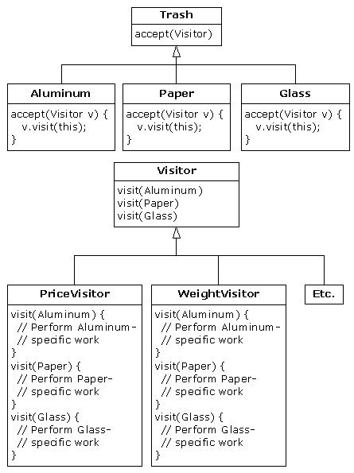

# 16.7 访问器范式


接下来，让我们思考如何将具有完全不同目标的一个设计范式应用到垃圾归类系统。

对这个范式，我们不再关心在系统中加入新型Trash时的优化。事实上，这个范式使新型Trash的添加显得更加复杂。假定我们有一个基本类结构，它是固定不变的；它或许来自另一个开发者或公司，我们无权对那个结构进行任何修改。然而，我们又希望在那个结构里加入新的多形性方法。这意味着我们一般必须在基础类的接口里添加某些东西。因此，我们目前面临的困境是一方面需要向基础类添加方法，另一方面又不能改动基础类。怎样解决这个问题呢？

“访问器”（Visitor）范式使我们能扩展基本类型的接口，方法是创建类型为Visitor的一个独立的类结构，对以后需对基本类型采取的操作进行虚拟。基本类型的任务就是简单地“接收”访问器，然后调用访问器的动态绑定方法。看起来就象下面这样：


 
现在，假如v是一个指向Aluminum（铝制品）的Visitable句柄，那么下述代码：

```
PriceVisitor pv = new PriceVisitor();
v.accept(pv);
```

会造成两个多形性方法调用：第一个会选择accept()的Aluminum版本；第二个则在accept()里——用基础类Visitor句柄v动态调用visit()的特定版本时。

这种配置意味着可采取Visitor的新子类的形式将新的功能添加到系统里，没必要接触Trash结构。这就是“访问器”范式最主要的优点：可为一个类结构添加新的多形性功能，同时不必改动结构——只要安装好了accept()方法。注意这个优点在这儿是有用的，但并不一定是我们在任何情况下的首选方案。所以在最开始的时候，就要判断这到底是不是自己需要的方案。

现在注意一件没有做成的事情：访问器方案防止了从主控Trash序列向单独类型序列的归类。所以我们可将所有东西都留在单主控序列中，只需用适当的访问器通过那个序列传递，即可达到希望的目标。尽管这似乎并非访问器范式的本意，但确实让我们达到了很希望达到的一个目标（避免使用RTTI）。

访问器范式中的双生派遣负责同时判断Trash以及Visitor的类型。在下面的例子中，大家可看到Visitor的两种实现方式：PriceVisitor用于判断总计及价格，而WeightVisitor用于跟踪重量。

可以看到，所有这些都是用回收程序一个新的、改进过的版本实现的。而且和DoubleDispatch.java一样，Trash类被保持孤立，并创建一个新接口来添加accept()方法：

```
//: Visitable.java
// An interface to add visitor functionality to 
// the Trash hierarchy without modifying the 
// base class.
package c16.trashvisitor;
import c16.trash.*;

interface Visitable {
  // The new method:
  void accept(Visitor v);
} ///:~
```

Aluminum，Paper，Glass以及Cardboard的子类型实现了accept()方法：

```
//: VAluminum.java
// Aluminum for the visitor pattern
package c16.trashvisitor;
import c16.trash.*;

public class VAluminum extends Aluminum 
    implements Visitable {
  public VAluminum(double wt) { super(wt); }
  public void accept(Visitor v) {
    v.visit(this);
  }
} ///:~
//: VPaper.java
// Paper for the visitor pattern
package c16.trashvisitor;
import c16.trash.*;

public class VPaper extends Paper 
    implements Visitable {
  public VPaper(double wt) { super(wt); }
  public void accept(Visitor v) {
    v.visit(this);
  }
} ///:~
//: VGlass.java
// Glass for the visitor pattern
package c16.trashvisitor;
import c16.trash.*;

public class VGlass extends Glass 
    implements Visitable {
  public VGlass(double wt) { super(wt); }
  public void accept(Visitor v) {
    v.visit(this);
  }
} ///:~
//: VCardboard.java
// Cardboard for the visitor pattern
package c16.trashvisitor;
import c16.trash.*;

public class VCardboard extends Cardboard 
    implements Visitable {
  public VCardboard(double wt) { super(wt); }
  public void accept(Visitor v) {
    v.visit(this);
  }
} ///:~
```

由于Visitor基础类没有什么需要实在的东西，可将其创建成一个接口：

```
//: Visitor.java
// The base interface for visitors
package c16.trashvisitor;
import c16.trash.*;

interface Visitor {
  void visit(VAluminum a);
  void visit(VPaper p);
  void visit(VGlass g);
  void visit(VCardboard c);
} ///:~

c16.TrashVisitor.VGlass:54
c16.TrashVisitor.VPaper:22
c16.TrashVisitor.VPaper:11
c16.TrashVisitor.VGlass:17
c16.TrashVisitor.VAluminum:89
c16.TrashVisitor.VPaper:88
c16.TrashVisitor.VAluminum:76
c16.TrashVisitor.VCardboard:96
c16.TrashVisitor.VAluminum:25
c16.TrashVisitor.VAluminum:34
c16.TrashVisitor.VGlass:11
c16.TrashVisitor.VGlass:68
c16.TrashVisitor.VGlass:43
c16.TrashVisitor.VAluminum:27
c16.TrashVisitor.VCardboard:44
c16.TrashVisitor.VAluminum:18
c16.TrashVisitor.VPaper:91
c16.TrashVisitor.VGlass:63
c16.TrashVisitor.VGlass:50
c16.TrashVisitor.VGlass:80
c16.TrashVisitor.VAluminum:81
c16.TrashVisitor.VCardboard:12
c16.TrashVisitor.VGlass:12
c16.TrashVisitor.VGlass:54
c16.TrashVisitor.VAluminum:36
c16.TrashVisitor.VAluminum:93
c16.TrashVisitor.VGlass:93
c16.TrashVisitor.VPaper:80
c16.TrashVisitor.VGlass:36
c16.TrashVisitor.VGlass:12
c16.TrashVisitor.VGlass:60
c16.TrashVisitor.VPaper:66
c16.TrashVisitor.VAluminum:36
c16.TrashVisitor.VCardboard:22
```

程序剩余的部分将创建特定的Visitor类型，并通过一个Trash对象列表发送它们：


```
//: TrashVisitor.java 
// The "visitor" pattern
package c16.trashvisitor;
import c16.trash.*;
import java.util.*;

// Specific group of algorithms packaged
// in each implementation of Visitor:
class PriceVisitor implements Visitor {
  private double alSum; // Aluminum
  private double pSum; // Paper
  private double gSum; // Glass
  private double cSum; // Cardboard
  public void visit(VAluminum al) {
    double v = al.weight() * al.value();
    System.out.println(
      "value of Aluminum= " + v);
    alSum += v;
  }
  public void visit(VPaper p) {
    double v = p.weight() * p.value();
    System.out.println(
      "value of Paper= " + v);
    pSum += v;
  }
  public void visit(VGlass g) {
    double v = g.weight() * g.value();
    System.out.println(
      "value of Glass= " + v);
    gSum += v;
  }
  public void visit(VCardboard c) {
    double v = c.weight() * c.value();
    System.out.println(
      "value of Cardboard = " + v);
    cSum += v;
  }
  void total() {
    System.out.println(
      "Total Aluminum: $" + alSum + "\n" +
      "Total Paper: $" + pSum + "\n" +
      "Total Glass: $" + gSum + "\n" +
      "Total Cardboard: $" + cSum);
  }
}

class WeightVisitor implements Visitor {
  private double alSum; // Aluminum
  private double pSum; // Paper
  private double gSum; // Glass
  private double cSum; // Cardboard
  public void visit(VAluminum al) {
    alSum += al.weight();
    System.out.println("weight of Aluminum = "
        + al.weight());
  }
  public void visit(VPaper p) {
    pSum += p.weight();
    System.out.println("weight of Paper = "
        + p.weight());
  }
  public void visit(VGlass g) {
    gSum += g.weight();
    System.out.println("weight of Glass = "
        + g.weight());
  }
  public void visit(VCardboard c) {
    cSum += c.weight();
    System.out.println("weight of Cardboard = "
        + c.weight());
  }
  void total() {
    System.out.println("Total weight Aluminum:"
        + alSum);
    System.out.println("Total weight Paper:"
        + pSum);
    System.out.println("Total weight Glass:"
        + gSum);
    System.out.println("Total weight Cardboard:"
        + cSum);
  }
}

public class TrashVisitor {
  public static void main(String[] args) {
    Vector bin = new Vector();
    // ParseTrash still works, without changes:
    ParseTrash.fillBin("VTrash.dat", bin);
    // You could even iterate through
    // a list of visitors!
    PriceVisitor pv = new PriceVisitor();
    WeightVisitor wv = new WeightVisitor();
    Enumeration it = bin.elements();
    while(it.hasMoreElements()) {
      Visitable v = (Visitable)it.nextElement();
      v.accept(pv);
      v.accept(wv);
    }
    pv.total();
    wv.total();
  }
} ///:~
```

注意main()的形状已再次发生了变化。现在只有一个垃圾（Trash）筒。两个Visitor对象被接收到序列中的每个元素内，它们会完成自己份内的工作。Visitor跟踪它们自己的内部数据，计算出总重和价格。

最好，将东西从序列中取出的时候，除了不可避免地向Trash造型以外，再没有运行期的类型验证。若在Java里实现了参数化类型，甚至那个造型操作也可以避免。

对比之前介绍过的双重派遣方案，区分这两种方案的一个办法是：在双重派遣方案中，每个子类创建时只会过载其中的一个过载方法，即add()。而在这里，每个过载的visit()方法都必须在Visitor的每个子类中进行过载。

1. 更多的结合？

这里还有其他许多代码，Trash结构和Visitor结构之间存在着明显的“结合”（Coupling）关系。然而，在它们所代表的类集内部，也存在着高度的凝聚力：都只做一件事情（Trash描述垃圾或废品，而Visitor描述对垃圾采取什么行动）。作为一套优秀的设计方案，这无疑是个良好的开端。当然就目前的情况来说，只有在我们添加新的Visitor类型时才能体会到它的好处。但在添加新类型的Trash时，它却显得有些碍手碍脚。

类与类之间低度的结合与类内高度的凝聚无疑是一个重要的设计目标。但只要稍不留神，就可能妨碍我们得到一个本该更出色的设计。从表面看，有些类不可避免地相互间存在着一些“亲密”关系。这种关系通常是成对发生的，可以叫作“对联”（Couplet）——比如集合和继承器（Enumeration）。前面的Trash-Visitor对似乎也是这样的一种“对联”。
