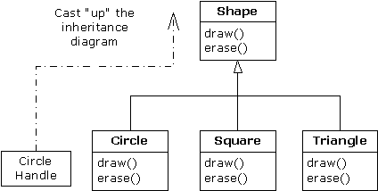
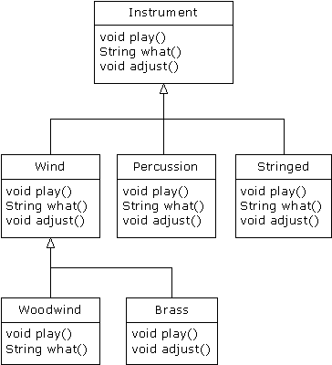

# 7.2 深入理解


对于Music.java的困难性，可通过运行程序加以体会。输出是Wind.play()。这当然是我们希望的输出，但它看起来似乎并不愿按我们的希望行事。请观察一下tune()方法：

```
public static void tune(Instrument i) {
// ...
i.play(Note.middleC);
}
```

它接收Instrument句柄。所以在这种情况下，编译器怎样才能知道Instrument句柄指向的是一个Wind，而不是一个Brass或Stringed呢？编译器无从得知。为了深入了理解这个问题，我们有必要探讨一下“绑定”这个主题。

7.2.1 方法调用的绑定

将一个方法调用同一个方法主体连接到一起就称为“绑定”（Binding）。若在程序运行以前执行绑定（由编译器和链接程序，如果有的话），就叫作“早期绑定”。大家以前或许从未听说过这个术语，因为它在任何程序化语言里都是不可能的。C编译器只有一种方法调用，那就是“早期绑定”。

上述程序最令人迷惑不解的地方全与早期绑定有关，因为在只有一个Instrument句柄的前提下，编译器不知道具体该调用哪个方法。

解决的方法就是“后期绑定”，它意味着绑定在运行期间进行，以对象的类型为基础。后期绑定也叫作“动态绑定”或“运行期绑定”。若一种语言实现了后期绑定，同时必须提供一些机制，可在运行期间判断对象的类型，并分别调用适当的方法。也就是说，编译器此时依然不知道对象的类型，但方法调用机制能自己去调查，找到正确的方法主体。不同的语言对后期绑定的实现方法是有所区别的。但我们至少可以这样认为：它们都要在对象中安插某些特殊类型的信息。

Java中绑定的所有方法都采用后期绑定技术，除非一个方法已被声明成final。这意味着我们通常不必决定是否应进行后期绑定——它是自动发生的。

为什么要把一个方法声明成final呢？正如上一章指出的那样，它能防止其他人覆盖那个方法。但也许更重要的一点是，它可有效地“关闭”动态绑定，或者告诉编译器不需要进行动态绑定。这样一来，编译器就可为final方法调用生成效率更高的代码。

7.2.2 产生正确的行为

知道Java里绑定的所有方法都通过后期绑定具有多形性以后，就可以相应地编写自己的代码，令其与基础类沟通。此时，所有的衍生类都保证能用相同的代码正常地工作。或者换用另一种方法，我们可以“将一条消息发给一个对象，让对象自行判断要做什么事情。”

在面向对象的程序设计中，有一个经典的“形状”例子。由于它很容易用可视化的形式表现出来，所以经常都用它说明问题。但很不幸的是，它可能误导初学者认为OOP只是为图形化编程设计的，这种认识当然是错误的。

形状例子有一个基础类，名为Shape；另外还有大量衍生类型：Circle（圆形），Square（方形），Triangle（三角形）等等。大家之所以喜欢这个例子，因为很容易理解“圆属于形状的一种类型”等概念。下面这幅继承图向我们展示了它们的关系：
 
 
 
上溯造型可用下面这个语句简单地表现出来：

```
Shape s = new Circle();
```

在这里，我们创建了Circle对象，并将结果句柄立即赋给一个Shape。这表面看起来似乎属于错误操作（将一种类型分配给另一个），但实际是完全可行的——因为按照继承关系，Circle属于Shape的一种。因此编译器认可上述语句，不会向我们提示一条出错消息。
当我们调用其中一个基础类方法时（已在衍生类里覆盖）：

```
s.draw();
```

同样地，大家也许认为会调用Shape的draw()，因为这毕竟是一个Shape句柄。那么编译器怎样才能知道该做其他任何事情呢？但此时实际调用的是Circle.draw()，因为后期绑定已经介入（多形性）。
下面这个例子从一个稍微不同的角度说明了问题：

```
//: Shapes.java
// Polymorphism in Java

class Shape { 
  void draw() {}
  void erase() {} 
}

class Circle extends Shape {
  void draw() { 
    System.out.println("Circle.draw()"); 
  }
  void erase() { 
    System.out.println("Circle.erase()"); 
  }
}

class Square extends Shape {
  void draw() { 
    System.out.println("Square.draw()"); 
  }
  void erase() { 
    System.out.println("Square.erase()"); 
  }
}

class Triangle extends Shape {
  void draw() { 
    System.out.println("Triangle.draw()"); 
  }
  void erase() { 
    System.out.println("Triangle.erase()");
  }
}

public class Shapes {
  public static Shape randShape() {
    switch((int)(Math.random() * 3)) {
      default: // To quiet the compiler
      case 0: return new Circle();
      case 1: return new Square();
      case 2: return new Triangle();
    }
  }
  public static void main(String[] args) {
    Shape[] s = new Shape[9];
    // Fill up the array with shapes:
    for(int i = 0; i < s.length; i++)
      s[i] = randShape();
    // Make polymorphic method calls:
    for(int i = 0; i < s.length; i++)
      s[i].draw();
  }
} ///:~
```

针对从Shape衍生出来的所有东西，Shape建立了一个通用接口——也就是说，所有（几何）形状都可以描绘和删除。衍生类覆盖了这些定义，为每种特殊类型的几何形状都提供了独一无二的行为。

在主类Shapes里，包含了一个static方法，名为randShape()。它的作用是在每次调用它时为某个随机选择的Shape对象生成一个句柄。请注意上溯造型是在每个return语句里发生的。这个语句取得指向一个Circle，Square或者Triangle的句柄，并将其作为返回类型Shape发给方法。所以无论什么时候调用这个方法，就绝对没机会了解它的具体类型到底是什么，因为肯定会获得一个单纯的Shape句柄。

main()包含了Shape句柄的一个数组，其中的数据通过对randShape()的调用填入。在这个时候，我们知道自己拥有Shape，但不知除此之外任何具体的情况（编译器同样不知）。然而，当我们在这个数组里步进，并为每个元素调用draw()的时候，与各类型有关的正确行为会魔术般地发生，就象下面这个输出示例展示的那样：

```
Circle.draw()
Triangle.draw()
Circle.draw()
Circle.draw()
Circle.draw()
Square.draw()
Triangle.draw()
Square.draw()
Square.draw()
```

当然，由于几何形状是每次随机选择的，所以每次运行都可能有不同的结果。之所以要突出形状的随机选择，是为了让大家深刻体会这一点：为了在编译的时候发出正确的调用，编译器毋需获得任何特殊的情报。对draw()的所有调用都是通过动态绑定进行的。

7.2.3 扩展性

现在，让我们仍然返回乐器（Instrument）示例。由于存在多形性，所以可根据自己的需要向系统里加入任意多的新类型，同时毋需更改tune()方法。在一个设计良好的OOP程序中，我们的大多数或者所有方法都会遵从tune()的模型，而且只与基础类接口通信。我们说这样的程序具有“扩展性”，因为可以从通用的基础类继承新的数据类型，从而新添一些功能。如果是为了适应新类的要求，那么对基础类接口进行操纵的方法根本不需要改变，
对于乐器例子，假设我们在基础类里加入更多的方法，以及一系列新类，那么会出现什么情况呢？下面是示意图：
 

 
所有这些新类都能与老类——tune()默契地工作，毋需对tune()作任何调整。即使tune()位于一个独立的文件里，而将新方法添加到Instrument的接口，tune()也能正确地工作，不需要重新编译。下面这个程序是对上述示意图的具体实现：

```
//: Music3.java
// An extensible program
import java.util.*;

class Instrument3 {
  public void play() {
    System.out.println("Instrument3.play()");
  }
  public String what() {
    return "Instrument3";
  }
  public void adjust() {}
}

class Wind3 extends Instrument3 {
  public void play() {
    System.out.println("Wind3.play()");
  }
  public String what() { return "Wind3"; }
  public void adjust() {}
}

class Percussion3 extends Instrument3 {
  public void play() {
    System.out.println("Percussion3.play()");
  }
  public String what() { return "Percussion3"; }
  public void adjust() {}
}

class Stringed3 extends Instrument3 {
  public void play() {
    System.out.println("Stringed3.play()");
  }
  public String what() { return "Stringed3"; }
  public void adjust() {}
}

class Brass3 extends Wind3 {
  public void play() {
    System.out.println("Brass3.play()");
  }
  public void adjust() {
    System.out.println("Brass3.adjust()");
  }
}

class Woodwind3 extends Wind3 {
  public void play() {
    System.out.println("Woodwind3.play()");
  }
  public String what() { return "Woodwind3"; }
}

public class Music3 {
  // Doesn't care about type, so new types
  // added to the system still work right:
  static void tune(Instrument3 i) {
    // ...
    i.play();
  }
  static void tuneAll(Instrument3[] e) {
    for(int i = 0; i < e.length; i++)
      tune(e[i]);
  }
  public static void main(String[] args) {
    Instrument3[] orchestra = new Instrument3[5];
    int i = 0;
    // Upcasting during addition to the array:
    orchestra[i++] = new Wind3();
    orchestra[i++] = new Percussion3();
    orchestra[i++] = new Stringed3();
    orchestra[i++] = new Brass3();
    orchestra[i++] = new Woodwind3();
    tuneAll(orchestra);
  }
} ///:~
```

新方法是what()和adjust()。前者返回一个String句柄，同时返回对那个类的说明；后者使我们能对每种乐器进行调整。

在main()中，当我们将某样东西置入Instrument3数组时，就会自动上溯造型到Instrument3。

可以看到，在围绕tune()方法的其他所有代码都发生变化的同时，tune()方法却丝毫不受它们的影响，依然故我地正常工作。这正是利用多形性希望达到的目标。我们对代码进行修改后，不会对程序中不应受到影响的部分造成影响。此外，我们认为多形性是一种至关重要的技术，它允许程序员“将发生改变的东西同没有发生改变的东西区分开”。
