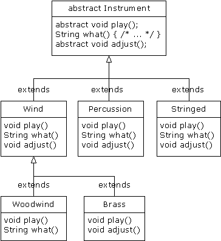

# 7.4 抽象类和方法


在我们所有乐器（Instrument）例子中，基础类Instrument内的方法都肯定是“伪”方法。若去调用这些方法，就会出现错误。那是由于Instrument的意图是为从它衍生出去的所有类都创建一个通用接口。

之所以要建立这个通用接口，唯一的原因就是它能为不同的子类型作出不同的表示。它为我们建立了一种基本形式，使我们能定义在所有衍生类里“通用”的一些东西。为阐述这个观念，另一个方法是把Instrument称为“抽象基础类”（简称“抽象类”）。若想通过该通用接口处理一系列类，就需要创建一个抽象类。对所有与基础类声明的签名相符的衍生类方法，都可以通过动态绑定机制进行调用（然而，正如上一节指出的那样，如果方法名与基础类相同，但自变量或参数不同，就会出现过载现象，那或许并非我们所愿意的）。

如果有一个象Instrument那样的抽象类，那个类的对象几乎肯定没有什么意义。换言之，Instrument的作用仅仅是表达接口，而不是表达一些具体的实施细节。所以创建一个Instrument对象是没有意义的，而且我们通常都应禁止用户那样做。为达到这个目的，可令Instrument内的所有方法都显示出错消息。但这样做会延迟信息到运行期，并要求在用户那一面进行彻底、可靠的测试。无论如何，最好的方法都是在编译期间捕捉到问题。

针对这个问题，Java专门提供了一种机制，名为“抽象方法”。它属于一种不完整的方法，只含有一个声明，没有方法主体。下面是抽象方法声明时采用的语法：

```
abstract void X();
```

包含了抽象方法的一个类叫作“抽象类”。如果一个类里包含了一个或多个抽象方法，类就必须指定成abstract（抽象）。否则，编译器会向我们报告一条出错消息。

若一个抽象类是不完整的，那么一旦有人试图生成那个类的一个对象，编译器又会采取什么行动呢？由于不能安全地为一个抽象类创建属于它的对象，所以会从编译器那里获得一条出错提示。通过这种方法，编译器可保证抽象类的“纯洁性”，我们不必担心会误用它。

如果从一个抽象类继承，而且想生成新类型的一个对象，就必须为基础类中的所有抽象方法提供方法定义。如果不这样做（完全可以选择不做），则衍生类也会是抽象的，而且编译器会强迫我们用abstract关键字标志那个类的“抽象”本质。

即使不包括任何abstract方法，亦可将一个类声明成“抽象类”。如果一个类没必要拥有任何抽象方法，而且我们想禁止那个类的所有实例，这种能力就会显得非常有用。

Instrument类可很轻松地转换成一个抽象类。只有其中一部分方法会变成抽象方法，因为使一个类抽象以后，并不会强迫我们将它的所有方法都同时变成抽象。下面是它看起来的样子：



下面是我们修改过的“管弦”乐器例子，其中采用了抽象类以及方法：

```
//: Music4.java
// Abstract classes and methods
import java.util.*;

abstract class Instrument4 {
  int i; // storage allocated for each
  public abstract void play();
  public String what() {
    return "Instrument4";
  }
  public abstract void adjust();
}

class Wind4 extends Instrument4 {
  public void play() {
    System.out.println("Wind4.play()");
  }
  public String what() { return "Wind4"; }
  public void adjust() {}
}

class Percussion4 extends Instrument4 {
  public void play() {
    System.out.println("Percussion4.play()");
  }
  public String what() { return "Percussion4"; }
  public void adjust() {}
}

class Stringed4 extends Instrument4 {
  public void play() {
    System.out.println("Stringed4.play()");
  }
  public String what() { return "Stringed4"; }
  public void adjust() {}
}

class Brass4 extends Wind4 {
  public void play() {
    System.out.println("Brass4.play()");
  }
  public void adjust() { 
    System.out.println("Brass4.adjust()");
  }
}

class Woodwind4 extends Wind4 {
  public void play() {
    System.out.println("Woodwind4.play()");
  }
  public String what() { return "Woodwind4"; }
}

public class Music4 {
  // Doesn't care about type, so new types
  // added to the system still work right:
  static void tune(Instrument4 i) {
    // ...
    i.play();
  }
  static void tuneAll(Instrument4[] e) {
    for(int i = 0; i < e.length; i++)
      tune(e[i]);
  }
  public static void main(String[] args) {
    Instrument4[] orchestra = new Instrument4[5];
    int i = 0;
    // Upcasting during addition to the array:
    orchestra[i++] = new Wind4();
    orchestra[i++] = new Percussion4();
    orchestra[i++] = new Stringed4();
    orchestra[i++] = new Brass4();
    orchestra[i++] = new Woodwind4();
    tuneAll(orchestra);
  }
} ///:~
```

可以看出，除基础类以外，实际并没有进行什么改变。

创建抽象类和方法有时对我们非常有用，因为它们使一个类的抽象变成明显的事实，可明确告诉用户和编译器自己打算如何用它。
