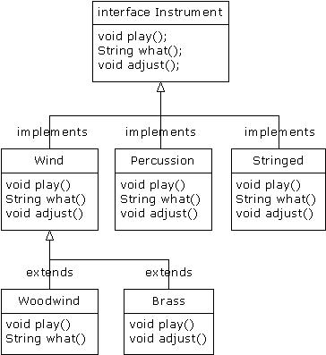
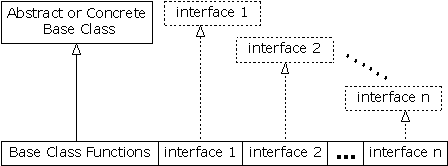

# 7.5 接口


“interface”（接口）关键字使抽象的概念更深入了一层。我们可将其想象为一个“纯”抽象类。它允许创建者规定一个类的基本形式：方法名、自变量列表以及返回类型，但不规定方法主体。接口也包含了基本数据类型的数据成员，但它们都默认为static和final。接口只提供一种形式，并不提供实施的细节。

接口这样描述自己：“对于实现我的所有类，看起来都应该象我现在这个样子”。因此，采用了一个特定接口的所有代码都知道对于那个接口可能会调用什么方法。这便是接口的全部含义。所以我们常把接口用于建立类和类之间的一个“协议”。有些面向对象的程序设计语言采用了一个名为“protocol”（协议）的关键字，它做的便是与接口相同的事情。

为创建一个接口，请使用interface关键字，而不要用class。与类相似，我们可在interface关键字的前面增加一个public关键字（但只有接口定义于同名的一个文件内）；或者将其省略，营造一种“友好的”状态。

为了生成与一个特定的接口（或一组接口）相符的类，要使用implements（实现）关键字。我们要表达的意思是“接口看起来就象那个样子，这儿是它具体的工作细节”。除这些之外，我们其他的工作都与继承极为相似。下面是乐器例子的示意图：



具体实现了一个接口以后，就获得了一个普通的类，可用标准方式对其进行扩展。

可决定将一个接口中的方法声明明确定义为“public”。但即便不明确定义，它们也会默认为public。所以在实现一个接口的时候，来自接口的方法必须定义成public。否则的话，它们会默认为“友好的”，而且会限制我们在继承过程中对一个方法的访问——Java编译器不允许我们那样做。

在Instrument例子的修改版本中，大家可明确地看出这一点。注意接口中的每个方法都严格地是一个声明，它是编译器唯一允许的。除此以外，Instrument5中没有一个方法被声明为public，但它们都会自动获得public属性。如下所示：

```
//: Music5.java
// Interfaces
import java.util.*;

interface Instrument5 {
  // Compile-time constant:
  int i = 5; // static & final
  // Cannot have method definitions:
  void play(); // Automatically public
  String what();
  void adjust();
}

class Wind5 implements Instrument5 {
  public void play() {
    System.out.println("Wind5.play()");
  }
  public String what() { return "Wind5"; }
  public void adjust() {}
}

class Percussion5 implements Instrument5 {
  public void play() {
    System.out.println("Percussion5.play()");
  }
  public String what() { return "Percussion5"; }
  public void adjust() {}
}

class Stringed5 implements Instrument5 {
  public void play() {
    System.out.println("Stringed5.play()");
  }
  public String what() { return "Stringed5"; }
  public void adjust() {}
}

class Brass5 extends Wind5 {
  public void play() {
    System.out.println("Brass5.play()");
  }
  public void adjust() { 
    System.out.println("Brass5.adjust()");
  }
}

class Woodwind5 extends Wind5 {
  public void play() {
    System.out.println("Woodwind5.play()");
  }
  public String what() { return "Woodwind5"; }
}

public class Music5 {
  // Doesn't care about type, so new types
  // added to the system still work right:
  static void tune(Instrument5 i) {
    // ...
    i.play();
  }
  static void tuneAll(Instrument5[] e) {
    for(int i = 0; i < e.length; i++)
      tune(e[i]);
  }
  public static void main(String[] args) {
    Instrument5[] orchestra = new Instrument5[5];
    int i = 0;
    // Upcasting during addition to the array:
    orchestra[i++] = new Wind5();
    orchestra[i++] = new Percussion5();
    orchestra[i++] = new Stringed5();
    orchestra[i++] = new Brass5();
    orchestra[i++] = new Woodwind5();
    tuneAll(orchestra);
  }
} ///:~
```

代码剩余的部分按相同的方式工作。我们可以自由决定上溯造型到一个名为Instrument5的“普通”类，一个名为Instrument5的“抽象”类，或者一个名为Instrument5的“接口”。所有行为都是相同的。事实上，我们在tune()方法中可以发现没有任何证据显示Instrument5到底是个“普通”类、“抽象”类还是一个“接口”。这是做是故意的：每种方法都使程序员能对对象的创建与使用进行不同的控制。

7.5.1 Java的“多重继承”

接口只是比抽象类“更纯”的一种形式。它的用途并不止那些。由于接口根本没有具体的实施细节——也就是说，没有与存储空间与“接口”关联在一起——所以没有任何办法可以防止多个接口合并到一起。这一点是至关重要的，因为我们经常都需要表达这样一个意思：“x从属于a，也从属于b，也从属于c”。在C++中，将多个类合并到一起的行动称作“多重继承”，而且操作较为不便，因为每个类都可能有一套自己的实施细节。在Java中，我们可采取同样的行动，但只有其中一个类拥有具体的实施细节。所以在合并多个接口的时候，C++的问题不会在Java中重演。如下所示：



在一个衍生类中，我们并不一定要拥有一个抽象或具体（没有抽象方法）的基础类。如果确实想从一个非接口继承，那么只能从一个继承。剩余的所有基本元素都必须是“接口”。我们将所有接口名置于implements关键字的后面，并用逗号分隔它们。可根据需要使用多个接口，而且每个接口都会成为一个独立的类型，可对其进行上溯造型。下面这个例子展示了一个“具体”类同几个接口合并的情况，它最终生成了一个新类：

```
//: Adventure.java
// Multiple interfaces
import java.util.*;

interface CanFight {
  void fight();
}

interface CanSwim {
  void swim();
}

interface CanFly {
  void fly();
}

class ActionCharacter {
  public void fight() {}
}

class Hero extends ActionCharacter 
    implements CanFight, CanSwim, CanFly {
  public void swim() {}
  public void fly() {}
}

public class Adventure {
  static void t(CanFight x) { x.fight(); }
  static void u(CanSwim x) { x.swim(); }
  static void v(CanFly x) { x.fly(); }
  static void w(ActionCharacter x) { x.fight(); }
  public static void main(String[] args) {
    Hero i = new Hero();
    t(i); // Treat it as a CanFight
    u(i); // Treat it as a CanSwim
    v(i); // Treat it as a CanFly
    w(i); // Treat it as an ActionCharacter
  }
} ///:~
```

从中可以看到，Hero将具体类ActionCharacter同接口CanFight，CanSwim以及CanFly合并起来。按这种形式合并一个具体类与接口的时候，具体类必须首先出现，然后才是接口（否则编译器会报错）。

请注意fight()的签名在CanFight接口与ActionCharacter类中是相同的，而且没有在Hero中为fight()提供一个具体的定义。接口的规则是：我们可以从它继承（稍后就会看到），但这样得到的将是另一个接口。如果想创建新类型的一个对象，它就必须是已提供所有定义的一个类。尽管Hero没有为fight()明确地提供一个定义，但定义是随同ActionCharacter来的，所以这个定义会自动提供，我们可以创建Hero的对象。

在类Adventure中，我们可看到共有四个方法，它们将不同的接口和具体类作为自己的自变量使用。创建一个Hero对象后，它可以传递给这些方法中的任何一个。这意味着它们会依次上溯造型到每一个接口。由于接口是用Java设计的，所以这样做不会有任何问题，而且程序员不必对此加以任何特别的关注。

注意上述例子已向我们揭示了接口最关键的作用，也是使用接口最重要的一个原因：能上溯造型至多个基础类。使用接口的第二个原因与使用抽象基础类的原因是一样的：防止客户程序员制作这个类的一个对象，以及规定它仅仅是一个接口。这样便带来了一个问题：到底应该使用一个接口还是一个抽象类呢？若使用接口，我们可以同时获得抽象类以及接口的好处。所以假如想创建的基础类没有任何方法定义或者成员变量，那么无论如何都愿意使用接口，而不要选择抽象类。事实上，如果事先知道某种东西会成为基础类，那么第一个选择就是把它变成一个接口。只有在必须使用方法定义或者成员变量的时候，才应考虑采用抽象类。

7.5.2 通过继承扩展接口

利用继承技术，可方便地为一个接口添加新的方法声明，也可以将几个接口合并成一个新接口。在这两种情况下，最终得到的都是一个新接口，如下例所示：

```
//: HorrorShow.java
// Extending an interface with inheritance

interface Monster {
  void menace();
}

interface DangerousMonster extends Monster {
  void destroy();
}

interface Lethal {
  void kill();
}

class DragonZilla implements DangerousMonster {
  public void menace() {}
  public void destroy() {}
}

interface Vampire 
    extends DangerousMonster, Lethal {
  void drinkBlood();
}

class HorrorShow {
  static void u(Monster b) { b.menace(); }
  static void v(DangerousMonster d) {
    d.menace();
    d.destroy();
  }
  public static void main(String[] args) {
    DragonZilla if2 = new DragonZilla();
    u(if2);
    v(if2);
  }
} ///:~
```

DangerousMonster是对Monster的一个简单的扩展，最终生成了一个新接口。这是在DragonZilla里实现的。
Vampire的语法仅在继承接口时才可使用。通常，我们只能对单独一个类应用extends（扩展）关键字。但由于接口可能由多个其他接口构成，所以在构建一个新接口时，extends可能引用多个基础接口。正如大家看到的那样，接口的名字只是简单地使用逗号分隔。

7.5.3 常数分组

由于置入一个接口的所有字段都自动具有static和final属性，所以接口是对常数值进行分组的一个好工具，它具有与C或C++的enum非常相似的效果。如下例所示：

```
//: Months.java
// Using interfaces to create groups of constants
package c07;

public interface Months {
  int
    JANUARY = 1, FEBRUARY = 2, MARCH = 3, 
    APRIL = 4, MAY = 5, JUNE = 6, JULY = 7, 
    AUGUST = 8, SEPTEMBER = 9, OCTOBER = 10,
    NOVEMBER = 11, DECEMBER = 12;
} ///:~
```

注意根据Java命名规则，拥有固定标识符的static final基本数据类型（亦即编译期常数）都全部采用大写字母（用下划线分隔单个标识符里的多个单词）。

接口中的字段会自动具备public属性，所以没必要专门指定。

现在，通过导入 `c07.*` 或 `c07.Months` ，我们可以从包的外部使用常数——就象对其他任何包进行的操作那样。此外，也可以用类似Months.JANUARY的表达式对值进行引用。当然，我们获得的只是一个int，所以不象C++的enum那样拥有额外的类型安全性。但与将数字强行编码（硬编码）到自己的程序中相比，这种（常用的）技术无疑已经是一个巨大的进步。我们通常把“硬编码”数字的行为称为“魔术数字”，它产生的代码是非常难以维护的。
如确实不想放弃额外的类型安全性，可构建象下面这样的一个类（注释①）：

```
//: Month2.java
// A more robust enumeration system
package c07;

public final class Month2 {
  private String name;
  private Month2(String nm) { name = nm; }
  public String toString() { return name; }
  public final static Month2
    JAN = new Month2("January"), 
    FEB = new Month2("February"),
    MAR = new Month2("March"),
    APR = new Month2("April"),
    MAY = new Month2("May"),
    JUN = new Month2("June"),
    JUL = new Month2("July"),
    AUG = new Month2("August"),
    SEP = new Month2("September"),
    OCT = new Month2("October"),
    NOV = new Month2("November"),
    DEC = new Month2("December");
  public final static Month2[] month =  {
    JAN, JAN, FEB, MAR, APR, MAY, JUN,
    JUL, AUG, SEP, OCT, NOV, DEC
  };
  public static void main(String[] args) {
    Month2 m = Month2.JAN;
    System.out.println(m);
    m = Month2.month[12];
    System.out.println(m);
    System.out.println(m == Month2.DEC);
    System.out.println(m.equals(Month2.DEC));
  }
} ///:~
```

①：是Rich Hoffarth的一封E-mail触发了我这样编写程序的灵感。

这个类叫作Month2，因为标准Java库里已经有一个Month。它是一个final类，并含有一个private构建器，所以没有人能从它继承，或制作它的一个实例。唯一的实例就是那些final static对象，它们是在类本身内部创建的，包括：JAN，FEB，MAR等等。这些对象也在month数组中使用，后者让我们能够按数字挑选月份，而不是按名字（注意数组中提供了一个多余的JAN，使偏移量增加了1，也使December确实成为12月）。在main()中，我们可注意到类型的安全性：m是一个Month2对象，所以只能将其分配给Month2。在前面的Months.java例子中，只提供了int值，所以本来想用来代表一个月份的int变量可能实际获得一个整数值，那样做可能不十分安全。
这儿介绍的方法也允许我们交换使用==或者equals()，就象main()尾部展示的那样。

7.5.4 初始化接口中的字段

接口中定义的字段会自动具有static和final属性。它们不能是“空白final”，但可初始化成非常数表达式。例如：

```
//: RandVals.java
// Initializing interface fields with 
// non-constant initializers
import java.util.*;

public interface RandVals {
  int rint = (int)(Math.random() * 10);
  long rlong = (long)(Math.random() * 10);
  float rfloat = (float)(Math.random() * 10);
  double rdouble = Math.random() * 10;
} ///:~
```

由于字段是static的，所以它们会在首次装载类之后、以及首次访问任何字段之前获得初始化。下面是一个简单的测试：

```
//: TestRandVals.java

public class TestRandVals {
  public static void main(String[] args) {
    System.out.println(RandVals.rint);
    System.out.println(RandVals.rlong);
    System.out.println(RandVals.rfloat);
    System.out.println(RandVals.rdouble);
  }
} ///:~
```

当然，字段并不是接口的一部分，而是保存于那个接口的static存储区域中。
