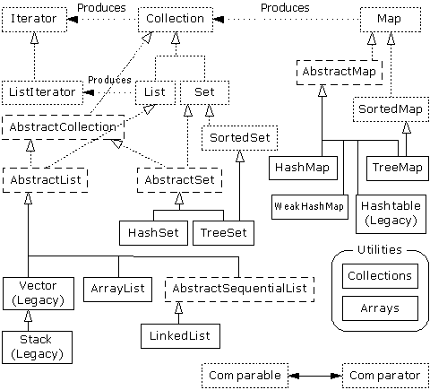

# 8.7 新集合

对我来说，集合类属于最强大的一种工具，特别适合在原创编程中使用。大家可能已感觉到我对Java 1.1提供的集合多少有点儿失望。因此，看到Java 1.2对集合重新引起了正确的注意后，确实令人非常愉快。这个版本的集合也得到了完全的重新设计（由Sun公司的Joshua Bloch）。我认为新设计的集合是Java 1.2中两项最主要的特性之一（另一项是Swing库，将在第13章叙述），因为它们极大方便了我们的编程，也使Java变成一种更成熟的编程系统。

有些设计使得元素间的结合变得更紧密，也更容易让人理解。例如，许多名字都变得更短、更明确了，而且更易使用；类型同样如此。有些名字进行了修改，更接近于通俗：我感觉特别好的一个是用“反复器”（Inerator）代替了“枚举”（Enumeration）。

此次重新设计也加强了集合库的功能。现在新增的行为包括链接列表、队列以及撤消组队（即“双终点队列”）。

集合库的设计是相当困难的（会遇到大量库设计问题）。在C++中，STL用多个不同的类来覆盖基础。这种做法比起STL以前是个很大的进步，那时根本没做这方面的考虑。但仍然没有很好地转换到Java里面。结果就是一大堆特别容易混淆的类。在另一个极端，我曾发现一个集合库由单个类构成：colleciton，它同时作为Vector和Hashtable使用。新集合库的设计者则希望达到一种新的平衡：实现人们希望从一个成熟集合库上获得的完整功能，同时又要比STL和其他类似的集合库更易学习和使用。这样得到的结果在某些场合显得有些古怪。但和早期Java库的一些决策不同，这些古怪之处并非偶然出现的，而是以复杂性作为代价，在进行仔细权衡之后得到的结果。这样做也许会延长人们掌握一些库概念的时间，但很快就会发现自己很乐于使用那些新工具，而且变得越来越离不了它。

新的集合库考虑到了“容纳自己对象”的问题，并将其分割成两个明确的概念：

(1) 集合（Collection）：一组单独的元素，通常应用了某种规则。在这里，一个List（列表）必须按特定的顺序容纳元素，而一个Set（集）不可包含任何重复的元素。相反，“包”（Bag）的概念未在新的集合库中实现，因为“列表”已提供了类似的功能。

(2) 映射（Map）：一系列“键－值”对（这已在散列表身上得到了充分的体现）。从表面看，这似乎应该成为一个“键－值”对的“集合”，但假若试图按那种方式实现它，就会发现实现过程相当笨拙。这进一步证明了应该分离成单独的概念。另一方面，可以方便地查看Map的某个部分。只需创建一个集合，然后用它表示那一部分即可。这样一来，Map就可以返回自己键的一个Set、一个包含自己值的List或者包含自己“键－值”对的一个List。和数组相似，Map可方便扩充到多个“维”，毋需涉及任何新概念。只需简单地在一个Map里包含其他Map（后者又可以包含更多的Map，以此类推）。

Collection和Map可通过多种形式实现，具体由编程要求决定。下面列出的是一个帮助大家理解的新集合示意图：



这张图刚开始的时候可能让人有点儿摸不着头脑，但在通读了本章以后，相信大家会真正理解它实际只有三个集合组件：Map，List和Set。而且每个组件实际只有两、三种实现方式（注释⑥），而且通常都只有一种特别好的方式。只要看出了这一点，集合就不会再令人生畏。

⑥：写作本章时，Java 1.2尚处于β测试阶段，所以这张示意图没有包括以后会加入的TreeSet。

虚线框代表“接口”，点线框代表“抽象”类，而实线框代表普通（实际）类。点线箭头表示一个特定的类准备实现一个接口（在抽象类的情况下，则是“部分”实现一个接口）。双线箭头表示一个类可生成箭头指向的那个类的对象。例如，任何集合都可以生成一个反复器（Iterator），而一个列表可以生成一个ListIterator（以及原始的反复器，因为列表是从集合继承的）。

致力于容纳对象的接口是Collection，List，Set和Map。在传统情况下，我们需要写大量代码才能同这些接口打交道。而且为了指定自己想使用的准确类型，必须在创建之初进行设置。所以可能创建下面这样的一个List：


```
List x = new LinkedList();
```

当然，也可以决定将x作为一个LinkedList使用（而不是一个普通的List），并用x负载准确的类型信息。使用接口的好处就是一旦决定改变自己的实施细节，要做的全部事情就是在创建的时候改变它，就象下面这样：

```
List x = new ArrayList();
```

其余代码可以保持原封不动。

在类的分级结构中，可看到大量以“Abstract”（抽象）开头的类，这刚开始可能会使人感觉迷惑。它们实际上是一些工具，用于“部分”实现一个特定的接口。举个例子来说，假如想生成自己的Set，就不是从Set接口开始，然后自行实现所有方法。相反，我们可以从AbstractSet继承，只需极少的工作即可得到自己的新类。尽管如此，新集合库仍然包含了足够的功能，可满足我们的几乎所有需求。所以考虑到我们的目的，可忽略所有以“Abstract”开头的类。

因此，在观看这张示意图时，真正需要关心的只有位于最顶部的“接口”以及普通（实际）类——均用实线方框包围。通常需要生成实际类的一个对象，将其上溯造型为对应的接口。以后即可在代码的任何地方使用那个接口。下面是一个简单的例子，它用String对象填充一个集合，然后打印出集合内的每一个元素：

```
//: SimpleCollection.java
// A simple example using the new Collections
package c08.newcollections;
import java.util.*;

public class SimpleCollection {
  public static void main(String[] args) {
    Collection c = new ArrayList();
    for(int i = 0; i < 10; i++)
      c.add(Integer.toString(i));
    Iterator it = c.iterator();
    while(it.hasNext())
      System.out.println(it.next());
  }
} ///:~
```

新集合库的所有代码示例都置于子目录newcollections下，这样便可提醒自己这些工作只对于Java 1.2有效。这样一来，我们必须用下述代码来调用程序：

```
java c08.newcollections.SimpleCollection
```

采用的语法与其他程序是差不多的。

大家可以看到新集合属于java.util库的一部分，所以在使用时不需要再添加任何额外的import语句。

main()的第一行创建了一个ArrayList对象，然后将其上溯造型成为一个集合。由于这个例子只使用了Collection方法，所以从Collection继承的一个类的任何对象都可以正常工作。但ArrayList是一个典型的Collection，它代替了Vector的位置。
显然，add()方法的作用是将一个新元素置入集合里。然而，用户文档谨慎地指出add()“保证这个集合包含了指定的元素”。这一点是为Set作铺垫的，后者只有在元素不存在的前提下才会真的加入那个元素。对于ArrayList以及其他任何形式的List，add()肯定意味着“直接加入”。

利用iterator()方法，所有集合都能生成一个“反复器”（Iterator）。反复器其实就象一个“枚举”（Enumeration），是后者的一个替代物，只是：

(1) 它采用了一个历史上默认、而且早在OOP中得到广泛采纳的名字（反复器）。

(2) 采用了比Enumeration更短的名字：hasNext()代替了hasMoreElement()，而next()代替了nextElement()。

(3) 添加了一个名为remove()的新方法，可删除由Iterator生成的上一个元素。所以每次调用next()的时候，只需调用remove()一次。

在SimpleCollection.java中，大家可看到创建了一个反复器，并用它在集合里遍历，打印出每个元素。

8.7.1 使用Collections

下面这张表格总结了用一个集合能做的所有事情（亦可对Set和List做同样的事情，尽管List还提供了一些额外的功能）。Map不是从Collection继承的，所以要单独对待。

```
Boolean add(Object)

*Ensures that the Collection contains the argument. Returns false if it doesn’t add the argument.

Boolean addAll(Collection)

*Adds all the elements in the argument. Returns true if any elements were added.

void clear( )

*Removes all the elements in the Collection. 

Boolean contains(Object)

True if the Collection contains the argument. 

Boolean containsAll(Collection)

True if the Collection contains all the elements in the argument. 

Boolean isEmpty( )

True if the Collection has no elements. 

Iterator iterator( )

Returns an Iterator that you can use to move through the elements in the Collection. 

Boolean remove(Object)

*If the argument is in the Collection, one instance of that element is removed. Returns true if a removal occurred.

Boolean removeAll(Collection)

*Removes all the elements that are contained in the argument. Returns true if any removals occurred.

Boolean retainAll(Collection)

*Retains only elements that are contained in the argument (an “intersection” from set theory). Returns true if any changes occurred.

int size( )

Returns the number of elements in the Collection. 

Object[] toArray( )

Returns an array containing all the elements in the Collection.

Object[] toArray(Object[] a)

Returns an array containing all the elements in the Collection, whose type is that of the array a rather than plain Object (you must cast the array to the right type).


*This is an “optional” method, which means it might not be implemented by a particular Collection. If not, that method throws an UnsupportedOperationException. Exceptions will be covered in Chapter 9.


boolean add(Object) ＊保证集合内包含了自变量。如果它没有添加自变量，就返回false（假）
boolean addAll(Collection) ＊添加自变量内的所有元素。如果没有添加元素，则返回true（真）
void clear() ＊删除集合内的所有元素
boolean contains(Object) 若集合包含自变量，就返回“真”
boolean containsAll(Collection) 若集合包含了自变量内的所有元素，就返回“真”
boolean isEmpty() 若集合内没有元素，就返回“真”
Iterator iterator() 返回一个反复器，以用它遍历集合的各元素
boolean remove(Object) ＊如自变量在集合里，就删除那个元素的一个实例。如果已进行了删除，就返回“真”
boolean removeAll(Collection) ＊删除自变量里的所有元素。如果已进行了任何删除，就返回“真”
boolean retainAll(Collection) ＊只保留包含在一个自变量里的元素（一个理论的“交集”）。如果已进行了任何改变，就返回“真”
int size() 返回集合内的元素数量
Object[] toArray() 返回包含了集合内所有元素的一个数组

＊这是一个“可选的”方法，有的集合可能并未实现它。若确实如此，该方法就会遇到一个UnsupportedOperatiionException，即一个“操作不支持”违例，详见第9章。
```

下面这个例子向大家演示了所有方法。同样地，它们只对从集合继承的东西有效，一个ArrayList作为一种“不常用的分母”使用：

```
//: Collection1.java
// Things you can do with all Collections
package c08.newcollections;
import java.util.*;

public class Collection1 {
  // Fill with 'size' elements, start
  // counting at 'start':
  public static Collection 
  fill(Collection c, int start, int size) {
    for(int i = start; i < start + size; i++)
      c.add(Integer.toString(i));
    return c;
  }
  // Default to a "start" of 0:
  public static Collection 
  fill(Collection c, int size) {
    return fill(c, 0, size);
  }
  // Default to 10 elements:
  public static Collection fill(Collection c) {
    return fill(c, 0, 10);
  }
  // Create & upcast to Collection:
  public static Collection newCollection() {
    return fill(new ArrayList());
    // ArrayList is used for simplicity, but it's
    // only seen as a generic Collection 
    // everywhere else in the program.
  }
  // Fill a Collection with a range of values:
  public static Collection 
  newCollection(int start, int size) {
    return fill(new ArrayList(), start, size);
  }
  // Moving through a List with an iterator:
  public static void print(Collection c) {
    for(Iterator x = c.iterator(); x.hasNext();)
      System.out.print(x.next() + " ");
    System.out.println();
  }    
  public static void main(String[] args) {
    Collection c = newCollection();
    c.add("ten");
    c.add("eleven");
    print(c);
    // Make an array from the List:
    Object[] array = c.toArray(); 
    // Make a String array from the List:
    String[] str = 
      (String[])c.toArray(new String[1]);
    // Find max and min elements; this means
    // different things depending on the way
    // the Comparable interface is implemented:
    System.out.println("Collections.max(c) = " +
      Collections.max(c));
    System.out.println("Collections.min(c) = " +
      Collections.min(c));
    // Add a Collection to another Collection
    c.addAll(newCollection());
    print(c);
    c.remove("3"); // Removes the first one
    print(c);
    c.remove("3"); // Removes the second one
    print(c);
    // Remove all components that are in the
    // argument collection:
    c.removeAll(newCollection());
    print(c);
    c.addAll(newCollection());
    print(c);
    // Is an element in this Collection?
    System.out.println(
      "c.contains(\"4\") = " + c.contains("4"));
    // Is a Collection in this Collection?
    System.out.println(
      "c.containsAll(newCollection()) = " + 
      c.containsAll(newCollection()));
    Collection c2 = newCollection(5, 3);
    // Keep all the elements that are in both
    // c and c2 (an intersection of sets):
    c.retainAll(c2);
    print(c);
    // Throw away all the elements in c that
    // also appear in c2:
    c.removeAll(c2);
    System.out.println("c.isEmpty() = " +
      c.isEmpty());
    c = newCollection();
    print(c);
    c.clear(); // Remove all elements
    System.out.println("after c.clear():");
    print(c);
  }
} ///:~
```

通过第一个方法，我们可用测试数据填充任何集合。在当前这种情况下，只是将int转换成String。第二个方法将在本章其余的部分经常采用。

newCollection()的两个版本都创建了ArrayList，用于包含不同的数据集，并将它们作为集合对象返回。所以很明显，除了Collection接口之外，不会再用到其他什么。

print()方法也会在本节经常用到。由于它用一个反复器（Iterator）在一个集合内遍历，而任何集合都可以产生这样的一个反复器，所以它适用于List和Set，也适用于由一个Map生成的Collection。

main()用简单的手段显示出了集合内的所有方法。

在后续的小节里，我们将比较List，Set和Map的不同实现方案，同时指出在各种情况下哪一种方案应成为首选（带有星号的那个）。大家会发现这里并未包括一些传统的类，如Vector，Stack以及Hashtable等。因为不管在什么情况下，新集合内都有自己首选的类。

8.7.2 使用Lists

```
List (interface)

Order is the most important feature of a List; it promises to maintain elements in a particular sequence. List adds a number of methods to Collection that allow insertion and removal of elements in the middle of a List. (This is recommended only for a LinkedList.) A List will produce a ListIterator, and using this you can traverse the List in both directions, as well as insert and remove elements in the middle of the list (again, recommended only for a LinkedList).

ArrayList*

A List backed by an array. Use instead of Vector as a general-purpose object holder. Allows rapid random access to elements, but is slow when inserting and removing elements from the middle of a list. ListIterator should be used only for back-and-forth traversal of an ArrayList, but not for inserting and removing elements, which is expensive compared to LinkedList.

LinkedList

Provides optimal sequential access, with inexpensive insertions and deletions from the middle of the list. Relatively slow for random access. (Use ArrayList instead.) Also has addFirst( ), addLast( ), getFirst( ), getLast( ), removeFirst( ), and removeLast( ) (which are not defined in any interfaces or base classes) to allow it to be used as a stack, a queue, and a dequeue.

```

List（接口） 顺序是List最重要的特性；它可保证元素按照规定的顺序排列。List为Collection添加了大量方法，以便我们在List中部插入和删除元素（只推荐对LinkedList这样做）。List也会生成一个ListIterator（列表反复器），利用它可在一个列表里朝两个方向遍历，同时插入和删除位于列表中部的元素（同样地，只建议对LinkedList这样做）

ArrayList＊ 由一个数组后推得到的List。作为一个常规用途的对象容器使用，用于替换原先的Vector。允许我们快速访问元素，但在从列表中部插入和删除元素时，速度却嫌稍慢。一般只应该用ListIterator对一个ArrayList进行向前和向后遍历，不要用它删除和插入元素；与LinkedList相比，它的效率要低许多

LinkedList 提供优化的顺序访问性能，同时可以高效率地在列表中部进行插入和删除操作。但在进行随机访问时，速度却相当慢，此时应换用ArrayList。也提供了addFirst()，addLast()，getFirst()，getLast()，removeFirst()以及removeLast()（未在任何接口或基础类中定义），以便将其作为一个规格、队列以及一个双向队列使用

下面这个例子中的方法每个都覆盖了一组不同的行为：每个列表都能做的事情（basicTest()），通过一个反复器遍历（iterMotion()）、用一个反复器改变某些东西（iterManipulation()）、体验列表处理的效果（testVisual()）以及只有LinkedList才能做的事情等：

```
//: List1.java
// Things you can do with Lists
package c08.newcollections;
import java.util.*;

public class List1 {
  // Wrap Collection1.fill() for convenience:
  public static List fill(List a) {
    return (List)Collection1.fill(a);
  }
  // You can use an Iterator, just as with a
  // Collection, but you can also use random
  // access with get():
  public static void print(List a) {
    for(int i = 0; i < a.size(); i++)
      System.out.print(a.get(i) + " ");
    System.out.println();
  }
  static boolean b;
  static Object o;
  static int i;
  static Iterator it;
  static ListIterator lit;
  public static void basicTest(List a) {
    a.add(1, "x"); // Add at location 1
    a.add("x"); // Add at end
    // Add a collection:
    a.addAll(fill(new ArrayList()));
    // Add a collection starting at location 3:
    a.addAll(3, fill(new ArrayList())); 
    b = a.contains("1"); // Is it in there?
    // Is the entire collection in there?
    b = a.containsAll(fill(new ArrayList()));
    // Lists allow random access, which is cheap
    // for ArrayList, expensive for LinkedList:
    o = a.get(1); // Get object at location 1
    i = a.indexOf("1"); // Tell index of object
    // indexOf, starting search at location 2:
    i = a.indexOf("1", 2);
    b = a.isEmpty(); // Any elements inside?
    it = a.iterator(); // Ordinary Iterator
    lit = a.listIterator(); // ListIterator
    lit = a.listIterator(3); // Start at loc 3
    i = a.lastIndexOf("1"); // Last match 
    i = a.lastIndexOf("1", 2); // ...after loc 2
    a.remove(1); // Remove location 1
    a.remove("3"); // Remove this object
    a.set(1, "y"); // Set location 1 to "y"
    // Keep everything that's in the argument
    // (the intersection of the two sets):
    a.retainAll(fill(new ArrayList()));
    // Remove elements in this range:
    a.removeRange(0, 2);
    // Remove everything that's in the argument:
    a.removeAll(fill(new ArrayList()));
    i = a.size(); // How big is it?
    a.clear(); // Remove all elements
  }
  public static void iterMotion(List a) {
    ListIterator it = a.listIterator();
    b = it.hasNext();
    b = it.hasPrevious();
    o = it.next();
    i = it.nextIndex();
    o = it.previous();
    i = it.previousIndex();
  }
  public static void iterManipulation(List a) {
    ListIterator it = a.listIterator();
    it.add("47");
    // Must move to an element after add():
    it.next();
    // Remove the element that was just produced:
    it.remove(); 
    // Must move to an element after remove():
    it.next();
    // Change the element that was just produced:
    it.set("47");
  }
  public static void testVisual(List a) {
    print(a);
    List b = new ArrayList();
    fill(b);
    System.out.print("b = ");
    print(b);
    a.addAll(b);
    a.addAll(fill(new ArrayList()));
    print(a);
    // Shrink the list by removing all the 
    // elements beyond the first 1/2 of the list
    System.out.println(a.size());
    System.out.println(a.size()/2);
    a.removeRange(a.size()/2, a.size()/2 + 2);
    print(a);
    // Insert, remove, and replace elements
    // using a ListIterator:
    ListIterator x = a.listIterator(a.size()/2);
    x.add("one"); 
    print(a);
    System.out.println(x.next());
    x.remove();
    System.out.println(x.next());
    x.set("47");
    print(a);
    // Traverse the list backwards:
    x = a.listIterator(a.size());
    while(x.hasPrevious())
      System.out.print(x.previous() + " ");
    System.out.println();
    System.out.println("testVisual finished");
  }
  // There are some things that only
  // LinkedLists can do:
  public static void testLinkedList() {
    LinkedList ll = new LinkedList();
    Collection1.fill(ll, 5);
    print(ll);
    // Treat it like a stack, pushing:
    ll.addFirst("one");
    ll.addFirst("two");
    print(ll);
    // Like "peeking" at the top of a stack:
    System.out.println(ll.getFirst());
    // Like popping a stack:
    System.out.println(ll.removeFirst());
    System.out.println(ll.removeFirst());
    // Treat it like a queue, pulling elements
    // off the tail end:
    System.out.println(ll.removeLast());
    // With the above operations, it's a dequeue!
    print(ll);
  }
  public static void main(String args[]) {
    // Make and fill a new list each time:
    basicTest(fill(new LinkedList()));
    basicTest(fill(new ArrayList()));
    iterMotion(fill(new LinkedList()));
    iterMotion(fill(new ArrayList()));
    iterManipulation(fill(new LinkedList()));
    iterManipulation(fill(new ArrayList()));
    testVisual(fill(new LinkedList()));
    testLinkedList();
  }
} ///:~
```

在basicTest()和iterMotiion()中，只是简单地发出调用，以便揭示出正确的语法。而且尽管捕获了返回值，但是并未使用它。在某些情况下，之所以不捕获返回值，是由于它们没有什么特别的用处。在正式使用它们前，应仔细研究一下自己的联机文档，掌握这些方法完整、正确的用法。

8.7.3 使用Sets

Set拥有与Collection完全相同的接口，所以和两种不同的List不同，它没有什么额外的功能。相反，Set完全就是一个Collection，只是具有不同的行为（这是实例和多形性最理想的应用：用于表达不同的行为）。在这里，一个Set只允许每个对象存在一个实例（正如大家以后会看到的那样，一个对象的“值”的构成是相当复杂的）。

```
Set (interface)

Each element that you add to the Set must be unique; otherwise the Set doesn’t add the duplicate element. Objects added to a Set must define equals( ) to establish object uniqueness. Set has exactly the same interface as Collection. The Set interface does not guarantee it will maintain its elements in any particular order.

HashSet*

For Sets where fast lookup time is important. Objects must also define hashCode( ).

TreeSet

An ordered Set backed by a red-black tree. This way, you can extract an ordered sequence from a Set.
```

Set（接口） 添加到Set的每个元素都必须是独一无二的；否则Set就不会添加重复的元素。添加到Set里的对象必须定义equals()，从而建立对象的唯一性。Set拥有与Collection完全相同的接口。一个Set不能保证自己可按任何特定的顺序维持自己的元素

HashSet＊ 用于除非常小的以外的所有Set。对象也必须定义hashCode()
ArraySet 由一个数组后推得到的Set。面向非常小的Set设计，特别是那些需要频繁创建和删除的。对于小Set，与HashSet相比，ArraySet创建和反复所需付出的代价都要小得多。但随着Set的增大，它的性能也会大打折扣。不需要HashCode()
TreeSet 由一个“红黑树”后推得到的顺序Set（注释⑦）。这样一来，我们就可以从一个Set里提到一个顺序集合

⑦：直至本书写作的时候，TreeSet仍然只是宣布，尚未正式实现。所以这里没有提供使用TreeSet的例子。

下面这个例子并没有列出用一个Set能够做的全部事情，因为接口与Collection是相同的，前例已经练习过了。相反，我们要例示的重点在于使一个Set独一无二的行为：

```
//: Set1.java
// Things you can do with Sets
package c08.newcollections;
import java.util.*;

public class Set1 {
  public static void testVisual(Set a) {
    Collection1.fill(a);
    Collection1.fill(a);
    Collection1.fill(a);
    Collection1.print(a); // No duplicates!
    // Add another set to this one:
    a.addAll(a);
    a.add("one"); 
    a.add("one"); 
    a.add("one");
    Collection1.print(a);
    // Look something up:
    System.out.println("a.contains(\"one\"): " +
      a.contains("one"));
  }
  public static void main(String[] args) {
    testVisual(new HashSet());
    testVisual(new TreeSet());
  }
} ///:~

```

重复的值被添加到Set，但在打印的时候，我们会发现Set只接受每个值的一个实例。

运行这个程序时，会注意到由HashSet维持的顺序与ArraySet是不同的。这是由于它们采用了不同的方法来保存元素，以便它们以后的定位。ArraySet保持着它们的顺序状态，而HashSet使用一个散列函数，这是特别为快速检索设计的）。创建自己的类型时，一定要注意Set需要通过一种方式来维持一种存储顺序，就象本章早些时候展示的“groundhog”（土拔鼠）例子那样。下面是一个例子：

```
//: Set2.java
// Putting your own type in a Set
package c08.newcollections;
import java.util.*;

class MyType implements Comparable {
  private int i;
  public MyType(int n) { i = n; }
  public boolean equals(Object o) {
    return 
      (o instanceof MyType) 
      && (i == ((MyType)o).i);
  }
  public int hashCode() { return i; }
  public String toString() { return i + " "; }
  public int compareTo(Object o) {
    int i2 = ((MyType) o).i;
    return (i2 < i ? -1 : (i2 == i ? 0 : 1));
  }
}

public class Set2 {
  public static Set fill(Set a, int size) {
    for(int i = 0; i < size; i++)
      a.add(new MyType(i));
    return a;
  }
  public static Set fill(Set a) {
    return fill(a, 10);
  }
  public static void test(Set a) {
    fill(a);
    fill(a); // Try to add duplicates
    fill(a);
    a.addAll(fill(new TreeSet()));
    System.out.println(a);
  }
  public static void main(String[] args) {
    test(new HashSet());
    test(new TreeSet());
  }
} ///:~

```

对equals()及hashCode()的定义遵照“groundhog”例子已经给出的形式。在两种情况下都必须定义一个equals()。但只有要把类置入一个HashSet的前提下，才有必要使用hashCode()——这种情况是完全有可能的，因为通常应先选择作为一个Set实现。

8.7.4 使用Maps

```
Map (interface)

Maintains key-value associations (pairs), so you can look up a value using a key.

HashMap*

Implementation based on a hash table. (Use this instead of Hashtable.) Provides constant-time performance for inserting and locating pairs. Performance can be adjusted via constructors that allow you to set the capacity and load factor of the hash table.

TreeMap

Implementation based on a red-black tree. When you view the keys or the pairs, they will be in sorted order (determined by Comparable or Comparator, discussed later). The point of a TreeMap is that you get the results in sorted order. TreeMap is the only Map with the subMap( ) method, which allows you to return a portion of the tree.

```


Map（接口） 维持“键－值”对应关系（对），以便通过一个键查找相应的值

`HashMap＊` 基于一个散列表实现（用它代替Hashtable）。针对“键－值”对的插入和检索，这种形式具有最稳定的性能。可通过构建器对这一性能进行调整，以便设置散列表的“能力”和“装载因子”

ArrayMap 由一个ArrayList后推得到的Map。对反复的顺序提供了精确的控制。面向非常小的Map设计，特别是那些需要经常创建和删除的。对于非常小的Map，创建和反复所付出的代价要比HashMap低得多。但在Map变大以后，性能也会相应地大幅度降低

TreeMap 在一个“红－黑”树的基础上实现。查看键或者“键－值”对时，它们会按固定的顺序排列（取决于Comparable或
Comparator，稍后即会讲到）。TreeMap最大的好处就是我们得到的是已排好序的结果。TreeMap是含有subMap()方法的唯一一种Map，利用它可以返回树的一部分

下例包含了两套测试数据以及一个fill()方法，利用该方法可以用任何两维数组（由Object构成）填充任何Map。这些工具也会在其他Map例子中用到。

```
//: Map1.java
// Things you can do with Maps
package c08.newcollections;
import java.util.*;

public class Map1 {
  public final static String[][] testData1 = {
    { "Happy", "Cheerful disposition" },
    { "Sleepy", "Prefers dark, quiet places" },
    { "Grumpy", "Needs to work on attitude" },
    { "Doc", "Fantasizes about advanced degree"},
    { "Dopey", "'A' for effort" },
    { "Sneezy", "Struggles with allergies" },
    { "Bashful", "Needs self-esteem workshop"},
  };
  public final static String[][] testData2 = {
    { "Belligerent", "Disruptive influence" },
    { "Lazy", "Motivational problems" },
    { "Comatose", "Excellent behavior" }
  };
  public static Map fill(Map m, Object[][] o) {
    for(int i = 0; i < o.length; i++)
      m.put(o[i][0], o[i][1]);
    return m;
  }
  // Producing a Set of the keys:
  public static void printKeys(Map m) {
    System.out.print("Size = " + m.size() +", ");
    System.out.print("Keys: ");
    Collection1.print(m.keySet());
  }
  // Producing a Collection of the values:
  public static void printValues(Map m) {
    System.out.print("Values: ");
    Collection1.print(m.values());
  }
  // Iterating through Map.Entry objects (pairs):
  public static void print(Map m) {
    Collection entries = m.entries();
    Iterator it = entries.iterator();
    while(it.hasNext()) {
      Map.Entry e = (Map.Entry)it.next();
      System.out.println("Key = " + e.getKey() +
        ", Value = " + e.getValue());
    }
  }
  public static void test(Map m) {
    fill(m, testData1);
    // Map has 'Set' behavior for keys:
    fill(m, testData1);
    printKeys(m);
    printValues(m);
    print(m);
    String key = testData1[4][0];
    String value = testData1[4][1];
    System.out.println("m.containsKey(\"" + key +
      "\"): " + m.containsKey(key));
    System.out.println("m.get(\"" + key + "\"): "
      + m.get(key));
    System.out.println("m.containsValue(\"" 
      + value + "\"): " + 
      m.containsValue(value)); 
    Map m2 = fill(new TreeMap(), testData2);
    m.putAll(m2);
    printKeys(m);
    m.remove(testData2[0][0]);
    printKeys(m);
    m.clear();
    System.out.println("m.isEmpty(): " 
      + m.isEmpty());
    fill(m, testData1);
    // Operations on the Set change the Map:
    m.keySet().removeAll(m.keySet());
    System.out.println("m.isEmpty(): " 
      + m.isEmpty());
  }
  public static void main(String args[]) {
    System.out.println("Testing HashMap");
    test(new HashMap());
    System.out.println("Testing TreeMap");
    test(new TreeMap());
  }
} ///:~

```

printKeys()，printValues()以及print()方法并不只是有用的工具，它们也清楚地揭示了一个Map的Collection“景象”的产生过程。keySet()方法会产生一个Set，它由Map中的键后推得来。在这儿，它只被当作一个Collection对待。values()也得到了类似的对待，它的作用是产生一个List，其中包含了Map中的所有值（注意键必须是独一无二的，而值可以有重复）。由于这些Collection是由Map后推得到的，所以一个Collection中的任何改变都会在相应的Map中反映出来。

print()方法的作用是收集由entries产生的Iterator（反复器），并用它同时打印出每个“键－值”对的键和值。程序剩余的部分提供了每种Map操作的简单示例，并对每种类型的Map进行了测试。

当创建自己的类，将其作为Map中的一个键使用时，必须注意到和以前的Set相同的问题。

8.7.5 决定实施方案

从早些时候的那幅示意图可以看出，实际上只有三个集合组件：Map，List和Set。而且每个接口只有两种或三种实施方案。若需使用由一个特定的接口提供的功能，如何才能决定到底采取哪一种方案呢？

为理解这个问题，必须认识到每种不同的实施方案都有自己的特点、优点和缺点。比如在那张示意图中，可以看到Hashtable，Vector和Stack的“特点”是它们都属于“传统”类，所以不会干扰原有的代码。但在另一方面，应尽量避免为新的（Java 1.2）代码使用它们。

其他集合间的差异通常都可归纳为它们具体是由什么“后推”的。换言之，取决于物理意义上用于实施目标接口的数据结构是什么。例如，ArrayList，LinkedList以及Vector（大致等价于ArrayList）都实现了List接口，所以无论选用哪一个，我们的程序都会得到类似的结果。然而，ArrayList（以及Vector）是由一个数组后推得到的；而LinkedList是根据常规的双重链接列表方式实现的，因为每个单独的对象都包含了数据以及指向列表内前后元素的句柄。正是由于这个原因，假如想在一个列表中部进行大量插入和删除操作，那么LinkedList无疑是最恰当的选择（LinkedList还有一些额外的功能，建立于AbstractSequentialList中）。若非如此，就情愿选择ArrayList，它的速度可能要快一些。

作为另一个例子，Set既可作为一个ArraySet实现，亦可作为HashSet实现。ArraySet是由一个ArrayList后推得到的，设计成只支持少量元素，特别适合要求创建和删除大量Set对象的场合使用。然而，一旦需要在自己的Set中容纳大量元素，ArraySet的性能就会大打折扣。写一个需要Set的程序时，应默认选择HashSet。而且只有在某些特殊情况下（对性能的提升有迫切的需求），才应切换到ArraySet。

1. 决定使用何种List

为体会各种List实施方案间的差异，最简便的方法就是进行一次性能测验。下述代码的作用是建立一个内部基础类，将其作为一个测试床使用。然后为每次测验都创建一个匿名内部类。每个这样的内部类都由一个test()方法调用。利用这种方法，可以方便添加和删除测试项目。

```
//: ListPerformance.java
// Demonstrates performance differences in Lists
package c08.newcollections;
import java.util.*;

public class ListPerformance {
  private static final int REPS = 100;
  private abstract static class Tester {
    String name;
    int size; // Test quantity
    Tester(String name, int size) { 
      this.name = name;
      this.size = size;
    }
    abstract void test(List a);
  }
  private static Tester[] tests = {
    new Tester("get", 300) { 
      void test(List a) {
        for(int i = 0; i < REPS; i++) {
          for(int j = 0; j < a.size(); j++)
            a.get(j);
        }
      }
    },
    new Tester("iteration", 300) { 
      void test(List a) {
        for(int i = 0; i < REPS; i++) {
          Iterator it = a.iterator();
          while(it.hasNext())
            it.next();
        }
      }
    },
    new Tester("insert", 1000) { 
      void test(List a) {
        int half = a.size()/2;
        String s = "test";
        ListIterator it = a.listIterator(half);
        for(int i = 0; i < size * 10; i++)
          it.add(s);
      }
    },
    new Tester("remove", 5000) { 
      void test(List a) {
        ListIterator it = a.listIterator(3);
        while(it.hasNext()) {
          it.next();
          it.remove();
        }
      }
    },
  };
  public static void test(List a) {
    // A trick to print out the class name:
    System.out.println("Testing " + 
      a.getClass().getName());
    for(int i = 0; i < tests.length; i++) {
      Collection1.fill(a, tests[i].size);
      System.out.print(tests[i].name);
      long t1 = System.currentTimeMillis();
      tests[i].test(a);
      long t2 = System.currentTimeMillis();
      System.out.println(": " + (t2 - t1));
    }
  }
  public static void main(String[] args) {
    test(new ArrayList());
    test(new LinkedList());
  }
} ///:~
```

内部类Tester是一个抽象类，用于为特定的测试提供一个基础类。它包含了一个要在测试开始时打印的字串、一个用于计算测试次数或元素数量的size参数、用于初始化字段的一个构建器以及一个抽象方法test()。test()做的是最实际的测试工作。各种类型的测试都集中到一个地方：tests数组。我们用继承于Tester的不同匿名内部类来初始化该数组。为添加或删除一个测试项目，只需在数组里简单地添加或移去一个内部类定义即可，其他所有工作都是自动进行的。

首先用元素填充传递给test()的List，然后对tests数组中的测试计时。由于测试用机器的不同，结果当然也会有所区别。这个程序的宗旨是揭示出不同集合类型的相对性能比较。下面是某一次运行得到的结果：

类型 获取 反复 插入 删除

```
ArrayList 110 270 1920 4780
LinkedList 1870 7580 170 110
```

可以看出，在ArrayList中进行随机访问（即get()）以及循环反复是最划得来的；但对于LinkedList却是一个不小的开销。但另一方面，在列表中部进行插入和删除操作对于LinkedList来说却比ArrayList划算得多。我们最好的做法也许是先选择一个ArrayList作为自己的默认起点。以后若发现由于大量的插入和删除造成了性能的降低，再考虑换成LinkedList不迟。

2. 决定使用何种Set

可在ArraySet以及HashSet间作出选择，具体取决于Set的大小（如果需要从一个Set中获得一个顺序列表，请用TreeSet；注释⑧）。下面这个测试程序将有助于大家作出这方面的抉择：

```
//: SetPerformance.java
package c08.newcollections;
import java.util.*;

public class SetPerformance {
  private static final int REPS = 200;
  private abstract static class Tester {
    String name;
    Tester(String name) { this.name = name; }
    abstract void test(Set s, int size);
  }
  private static Tester[] tests = {
    new Tester("add") { 
      void test(Set s, int size) {
        for(int i = 0; i < REPS; i++) {
          s.clear();
          Collection1.fill(s, size);
        }
      }
    },
    new Tester("contains") { 
      void test(Set s, int size) {
        for(int i = 0; i < REPS; i++)
          for(int j = 0; j < size; j++)
            s.contains(Integer.toString(j));
      }
    },
    new Tester("iteration") { 
      void test(Set s, int size) {
        for(int i = 0; i < REPS * 10; i++) {
          Iterator it = s.iterator();
          while(it.hasNext())
            it.next();
        }
      }
    },
  };
  public static void test(Set s, int size) {
    // A trick to print out the class name:
    System.out.println("Testing " + 
      s.getClass().getName() + " size " + size);
    Collection1.fill(s, size);
    for(int i = 0; i < tests.length; i++) {
      System.out.print(tests[i].name);
      long t1 = System.currentTimeMillis();
      tests[i].test(s, size);
      long t2 = System.currentTimeMillis();
      System.out.println(": " + 
        ((double)(t2 - t1)/(double)size));
    }
  }
  public static void main(String[] args) {
    // Small:
    test(new TreeSet(), 10);
    test(new HashSet(), 10);
    // Medium:
    test(new TreeSet(), 100);
    test(new HashSet(), 100);
    // Large:
    test(new HashSet(), 1000);
    test(new TreeSet(), 1000);
  }
} ///:~
```

⑧：TreeSet在本书写作时尚未成为一个正式的特性，但在这个例子中可以很轻松地为其添加一个测试。

最后对ArraySet的测试只有500个元素，而不是1000个，因为它太慢了。

类型 测试大小 添加 包含 反复


Type

Test size

Add

Contains

Iteration


10

22.0

11.0

16.0

TreeSet 

100

22.5

13.2

12.1


1000

31.1

18.7

11.8


10

5.0

6.0

27.0

HashSet 

100

6.6

6.6

10.9


1000

7.4

6.6

9.5


进行add()以及contains()操作时，HashSet显然要比ArraySet出色得多，而且性能明显与元素的多寡关系不大。一般编写程序的时候，几乎永远用不着使用ArraySet。

3. 决定使用何种Map

选择不同的Map实施方案时，注意Map的大小对于性能的影响是最大的，下面这个测试程序清楚地阐示了这一点：

```
//: MapPerformance.java
// Demonstrates performance differences in Maps
package c08.newcollections;
import java.util.*;

public class MapPerformance {
  private static final int REPS = 200;
  public static Map fill(Map m, int size) {
    for(int i = 0; i < size; i++) {
      String x = Integer.toString(i);
      m.put(x, x);
    }
    return m;
  }
  private abstract static class Tester {
    String name;
    Tester(String name) { this.name = name; }
    abstract void test(Map m, int size);
  }
  private static Tester[] tests = {
    new Tester("put") { 
      void test(Map m, int size) {
        for(int i = 0; i < REPS; i++) {
          m.clear();
          fill(m, size);
        }
      }
    },
    new Tester("get") { 
      void test(Map m, int size) {
        for(int i = 0; i < REPS; i++)
          for(int j = 0; j < size; j++)
            m.get(Integer.toString(j));
      }
    },
    new Tester("iteration") { 
      void test(Map m, int size) {
        for(int i = 0; i < REPS * 10; i++) {
          Iterator it = m.entries().iterator();
          while(it.hasNext())
            it.next();
        }
      }
    },
  };
  public static void test(Map m, int size) {
    // A trick to print out the class name:
    System.out.println("Testing " + 
      m.getClass().getName() + " size " + size);
    fill(m, size);
    for(int i = 0; i < tests.length; i++) {
      System.out.print(tests[i].name);
      long t1 = System.currentTimeMillis();
      tests[i].test(m, size);
      long t2 = System.currentTimeMillis();
      System.out.println(": " + 
        ((double)(t2 - t1)/(double)size));
    }
  }
  public static void main(String[] args) {
    // Small:
    test(new Hashtable(), 10);
    test(new HashMap(), 10);
    test(new TreeMap(), 10);
    // Medium:
    test(new Hashtable(), 100);
    test(new HashMap(), 100);
    test(new TreeMap(), 100);
    // Large:
    test(new HashMap(), 1000);
    test(new Hashtable(), 1000);
    test(new TreeMap(), 1000);
  }
} ///:~
```

由于Map的大小是最严重的问题，所以程序的计时测试按Map的大小（或容量）来分割时间，以便得到令人信服的测试结果。下面列出一系列结果（在你的机器上可能不同）：

类型 测试大小 置入 取出 反复
Type 

Test size

Put

Get

Iteration


10

11.0

5.0

44.0

Hashtable

100

7.7

7.7

16.5


1000

8.0

8.0

14.4


10

16.0

11.0

22.0

TreeMap

100

25.8

15.4

13.2


1000

33.8

20.9

13.6


10

11.0

6.0

33.0

HashMap

100

8.2

7.7

13.7


1000

8.0

7.8

11.9


即使大小为10，ArrayMap的性能也要比HashMap差——除反复循环时以外。而在使用Map时，反复的作用通常并不重要（get()通常是我们时间花得最多的地方）。TreeMap提供了出色的put()以及反复时间，但get()的性能并不佳。但是，我们为什么仍然需要使用TreeMap呢？这样一来，我们可以不把它作为Map使用，而作为创建顺序列表的一种途径。树的本质在于它总是顺序排列的，不必特别进行排序（它的排序方式马上就要讲到）。一旦填充了一个TreeMap，就可以调用keySet()来获得键的一个Set“景象”。然后用toArray()产生包含了那些键的一个数组。随后，可用static方法Array.binarySearch()快速查找排好序的数组中的内容。当然，也许只有在HashMap的行为不可接受的时候，才需要采用这种做法。因为HashMap的设计宗旨就是进行快速的检索操作。最后，当我们使用Map时，首要的选择应该是HashMap。只有在极少数情况下才需要考虑其他方法。
此外，在上面那张表里，有另一个性能问题没有反映出来。下述程序用于测试不同类型Map的创建速度：


```
//: MapCreation.java
// Demonstrates time differences in Map creation
package c08.newcollections;
import java.util.*;

public class MapCreation {
  public static void main(String[] args) {
    final long REPS = 100000;
    long t1 = System.currentTimeMillis();
    System.out.print("Hashtable");
    for(long i = 0; i < REPS; i++)
      new Hashtable();
    long t2 = System.currentTimeMillis();
    System.out.println(": " + (t2 - t1));
    t1 = System.currentTimeMillis();
    System.out.print("TreeMap");
    for(long i = 0; i < REPS; i++)
      new TreeMap();
    t2 = System.currentTimeMillis();
    System.out.println(": " + (t2 - t1));
    t1 = System.currentTimeMillis();
    System.out.print("HashMap");
    for(long i = 0; i < REPS; i++)
      new HashMap();
    t2 = System.currentTimeMillis();
    System.out.println(": " + (t2 - t1));
  }
} ///:~

```

在写这个程序期间，TreeMap的创建速度比其他两种类型明显快得多（但你应亲自尝试一下，因为据说新版本可能会改善ArrayMap的性能）。考虑到这方面的原因，同时由于前述TreeMap出色的put()性能，所以如果需要创建大量Map，而且只有在以后才需要涉及大量检索操作，那么最佳的策略就是：创建和填充TreeMap；以后检索量增大的时候，再将重要的TreeMap转换成HashMap——使用HashMap(Map)构建器。同样地，只有在事实证明确实存在性能瓶颈后，才应关心这些方面的问题——先用起来，再根据需要加快速度。

8.7.6 未支持的操作

利用static（静态）数组Arrays.toList()，也许能将一个数组转换成List，如下所示：

```
//: Unsupported.java
// Sometimes methods defined in the Collection
// interfaces don't work!
package c08.newcollections;
import java.util.*;

public class Unsupported {
  private static String[] s = {
    "one", "two", "three", "four", "five",
    "six", "seven", "eight", "nine", "ten",
  };
  static List a = Arrays.toList(s);
  static List a2 = Arrays.toList(
    new String[] { s[3], s[4], s[5] });
  public static void main(String[] args) {
    Collection1.print(a); // Iteration
    System.out.println(
      "a.contains(" + s[0] + ") = " + 
      a.contains(s[0]));
    System.out.println(
      "a.containsAll(a2) = " + 
      a.containsAll(a2));
    System.out.println("a.isEmpty() = " +
      a.isEmpty());
    System.out.println(
      "a.indexOf(" + s[5] + ") = " + 
      a.indexOf(s[5]));
    // Traverse backwards:
    ListIterator lit = a.listIterator(a.size());
    while(lit.hasPrevious())
      System.out.print(lit.previous());
    System.out.println();
    // Set the elements to different values:
    for(int i = 0; i < a.size(); i++)
      a.set(i, "47");
    Collection1.print(a);
    // Compiles, but won't run:
    lit.add("X"); // Unsupported operation
    a.clear(); // Unsupported
    a.add("eleven"); // Unsupported
    a.addAll(a2); // Unsupported
    a.retainAll(a2); // Unsupported
    a.remove(s[0]); // Unsupported
    a.removeAll(a2); // Unsupported
  }
} ///:~

```

从中可以看出，实际只实现了Collection和List接口的一部分。剩余的方法导致了不受欢迎的一种情况，名为UnsupportedOperationException。在下一章里，我们会讲述违例的详细情况，但在这里有必要进行一下简单说明。这里的关键在于“集合接口”，以及新集合库内的另一些接口，它们都包含了“可选的”方法。在实现那些接口的集合类中，或者提供、或者没有提供对那些方法的支持。若调用一个未获支持的方法，就会导致一个UnsupportedOperationException（操作未支持违例），这表明出现了一个编程错误。

大家或许会觉得奇怪，不是说“接口”和基础类最大的“卖点”就是它们许诺这些方法能产生一些有意义的行为吗？上述违例破坏了那个许诺——它调用的一部分方法不仅不能产生有意义的行为，而且还会中止程序的运行。在这些情况下，类型的所谓安全保证似乎显得一钱不值！但是，情况并没有想象的那么坏。通过Collection，List，Set或者Map，编译器仍然限制我们只能调用那个接口中的方法，所以它和Smalltalk还是存在一些区别的（在Smalltalk中，可为任何对象调用任何方法，而且只有在运行程序时才知道这些调用是否可行）。除此以外，以Collection作为自变量的大多数方法只能从那个集合中读取数据——Collection的所有“read”方法都不是可选的。

这样一来，系统就可避免在设计期间出现接口的冲突。而在集合库的其他设计方案中，最终经常都会得到数量过多的接口，用它们描述基本方案的每一种变化形式，所以学习和掌握显得非常困难。有些时候，甚至难于捕捉接口中的所有特殊情况，因为人们可能设计出任何新接口。但Java的“不支持的操作”方法却达到了新集合库的一个重要设计目标：易于学习和使用。但是，为了使这一方法真正有效，却需满足下述条件：

(1) UnsupportedOperationException必须属于一种“非常”事件。也就是说，对于大多数类来说，所有操作都应是可行的。只有在一些特殊情况下，一、两个操作才可能未获支持。新集合库满足了这一条件，因为绝大多数时候用到的类——ArrayList，LinkedList，HashList和HashMap，以及其他集合方案——都提供了对所有操作的支持。但是，如果想新建一个集合，同时不想为集合接口中的所有方法都提供有意义的定义，同时令其仍与现有库配合，这种设计方法也确实提供了一个“后门”可以利用。

(2) 若一个操作未获支持，那么UnsupportedOperationException（未支持的操作违例）极有可能在实现期间出现，则不是在产品已交付给客户以后才会出现。它毕竟指出的是一个编程错误——不正确地使用了一个类。这一点不能十分确定，通过也可以看出这种方案的“试验”特征——只有经过多次试验，才能找出最理想的工作方式。

在上面的例子中，Arrays.toList()产生了一个List（列表），该列表是由一个固定长度的数组后推出来的。因此唯一能够支持的就是那些不改变数组长度的操作。在另一方面，若请求一个新接口表达不同种类的行为（可能叫作“FixedSizeList”——固定长度列表），就有遭遇更大的复杂程度的危险。这样一来，以后试图使用库的时候，很快就会发现自己不知从何处下手。

对那些采用Collection，List，Set或者Map作为参数的方法，它们的文档应当指出哪些可选的方法是必须实现的。举个例子来说，排序要求实现set()和Iterator.set()方法，但不包括add()和remove()。

8.7.7 排序和搜索

Java 1.2添加了自己的一套实用工具，可用来对数组或列表进行排列和搜索。这些工具都属于两个新类的“静态”方法。这两个类分别是用于排序和搜索数组的Arrays，以及用于排序和搜索列表的Collections。

1. 数组

Arrays类为所有基本数据类型的数组提供了一个过载的sort()和binarySearch()，它们亦可用于String和Object。下面这个例子显示出如何排序和搜索一个字节数组（其他所有基本数据类型都是类似的）以及一个String数组：

```
//: Array1.java
// Testing the sorting & searching in Arrays
package c08.newcollections;
import java.util.*;

public class Array1 {
  static Random r = new Random();
  static String ssource = 
    "ABCDEFGHIJKLMNOPQRSTUVWXYZ" +
    "abcdefghijklmnopqrstuvwxyz";
  static char[] src = ssource.toCharArray();
  // Create a random String
  public static String randString(int length) {
    char[] buf = new char[length];
    int rnd;
    for(int i = 0; i < length; i++) {
      rnd = Math.abs(r.nextInt()) % src.length;
      buf[i] = src[rnd];
    }
    return new String(buf);
  }
  // Create a random array of Strings:
  public static 
  String[] randStrings(int length, int size) {
    String[] s = new String[size];
    for(int i = 0; i < size; i++)
      s[i] = randString(length);
    return s;
  }
  public static void print(byte[] b) {
    for(int i = 0; i < b.length; i++)
      System.out.print(b[i] + " ");
    System.out.println();
  }
  public static void print(String[] s) {
    for(int i = 0; i < s.length; i++)
      System.out.print(s[i] + " ");
    System.out.println();
  }
  public static void main(String[] args) {
    byte[] b = new byte[15];
    r.nextBytes(b); // Fill with random bytes
    print(b);
    Arrays.sort(b);
    print(b);
    int loc = Arrays.binarySearch(b, b[10]);
    System.out.println("Location of " + b[10] +
      " = " + loc);
    // Test String sort & search:
    String[] s = randStrings(4, 10);
    print(s);
    Arrays.sort(s);
    print(s);
    loc = Arrays.binarySearch(s, s[4]);
    System.out.println("Location of " + s[4] +
      " = " + loc);
  }
} ///:~
```

类的第一部分包含了用于产生随机字串对象的实用工具，可供选择的随机字母保存在一个字符数组中。randString()返回一个任意长度的字串；而readStrings()创建随机字串的一个数组，同时给定每个字串的长度以及希望的数组大小。两个print()方法简化了对示范数组的显示。在main()中，Random.nextBytes()用随机选择的字节填充数组自变量（没有对应的Random方法用于创建其他基本数据类型的数组）。获得一个数组后，便可发现为了执行sort()或者binarySearch()，只需发出一次方法调用即可。与binarySearch()有关的还有一个重要的警告：若在执行一次binarySearch()之前不调用sort()，便会发生不可预测的行为，其中甚至包括无限循环。

对String的排序以及搜索是相似的，但在运行程序的时候，我们会注意到一个有趣的现象：排序遵守的是字典顺序，亦即大写字母在字符集中位于小写字母的前面。因此，所有大写字母都位于列表的最前面，后面再跟上小写字母——Z居然位于a的前面。似乎连电话簿也是这样排序的。

2. 可比较与比较器

但假若我们不满足这一排序方式，又该如何处理呢？例如本书后面的索引，如果必须对以A或a开头的词条分别到两处地方查看，那么肯定会使读者颇不耐烦。

若想对一个Object数组进行排序，那么必须解决一个问题。根据什么来判定两个Object的顺序呢？不幸的是，最初的Java设计者并不认为这是一个重要的问题，否则就已经在根类Object里定义它了。这样造成的一个后果便是：必须从外部进行Object的排序，而且新的集合库提供了实现这一操作的标准方式（最理想的是在Object里定义它）。

针对Object数组（以及String，它当然属于Object的一种），可使用一个sort()，并令其接纳另一个参数：实现了Comparator接口（即“比较器”接口，新集合库的一部分）的一个对象，并用它的单个compare()方法进行比较。这个方法将两个准备比较的对象作为自己的参数使用——若第一个参数小于第二个，返回一个负整数；若相等，返回零；若第一个参数大于第二个，则返回正整数。基于这一规则，上述例子的String部分便可重新写过，令其进行真正按字母顺序的排序：


```
//: AlphaComp.java
// Using Comparator to perform an alphabetic sort
package c08.newcollections;
import java.util.*;

public class AlphaComp implements Comparator {
  public int compare(Object o1, Object o2) {
    // Assume it's used only for Strings...
    String s1 = ((String)o1).toLowerCase();
    String s2 = ((String)o2).toLowerCase();
    return s1.compareTo(s2);
  }
  public static void main(String[] args) {
    String[] s = Array1.randStrings(4, 10);
    Array1.print(s);
    AlphaComp ac = new AlphaComp();
    Arrays.sort(s, ac);
    Array1.print(s);
    // Must use the Comparator to search, also:
    int loc = Arrays.binarySearch(s, s[3], ac);
    System.out.println("Location of " + s[3] +
     " = " + loc);
  }
} ///:~
```

通过造型为String，compare()方法会进行“暗示”性的测试，保证自己操作的只能是String对象——运行期系统会捕获任何差错。将两个字串都强迫换成小写形式后，String.compareTo()方法会产生预期的结果。

若用自己的Comparator来进行一次sort()，那么在使用binarySearch()时必须使用那个相同的Comparator。

Arrays类提供了另一个sort()方法，它会采用单个自变量：一个Object数组，但没有Comparator。这个sort()方法也必须用同样的方式来比较两个Object。通过实现Comparable接口，它采用了赋予一个类的“自然比较方法”。这个接口含有单独一个方法——compareTo()，能分别根据它小于、等于或者大于自变量而返回负数、零或者正数，从而实现对象的比较。下面这个例子简单地阐示了这一点：

```
//: CompClass.java
// A class that implements Comparable
package c08.newcollections;
import java.util.*;

public class CompClass implements Comparable {
  private int i;
  public CompClass(int ii) { i = ii; }
  public int compareTo(Object o) {
    // Implicitly tests for correct type:
    int argi = ((CompClass)o).i;
    if(i == argi) return 0;
    if(i < argi) return -1;
    return 1;
  }
  public static void print(Object[] a) {
    for(int i = 0; i < a.length; i++)
      System.out.print(a[i] + " ");
    System.out.println();
  }
  public String toString() { return i + ""; }
  public static void main(String[] args) {
    CompClass[] a = new CompClass[20];
    for(int i = 0; i < a.length; i++)
      a[i] = new CompClass(
        (int)(Math.random() *100));
    print(a);
    Arrays.sort(a);
    print(a);
    int loc = Arrays.binarySearch(a, a[3]);
    System.out.println("Location of " + a[3] +
     " = " + loc);
  }
} ///:~
```

当然，我们的compareTo()方法亦可根据实际情况增大复杂程度。

3. 列表

可用与数组相同的形式排序和搜索一个列表（List）。用于排序和搜索列表的静态方法包含在类Collections中，但它们拥有与Arrays中差不多的签名：sort(List)用于对一个实现了Comparable的对象列表进行排序；binarySearch(List,Object)用于查找列表中的某个对象；sort(List,Comparator)利用一个“比较器”对一个列表进行排序；

而binarySearch(List,Object,Comparator)则用于查找那个列表中的一个对象（注释⑨）。下面这个例子利用了预先定义好的CompClass和AlphaComp来示范Collections中的各种排序工具：

```
//: ListSort.java
// Sorting and searching Lists with 'Collections'
package c08.newcollections;
import java.util.*;

public class ListSort {
  public static void main(String[] args) {
    final int SZ = 20;
    // Using "natural comparison method":
    List a = new ArrayList();
    for(int i = 0; i < SZ; i++)
      a.add(new CompClass(
        (int)(Math.random() *100)));
    Collection1.print(a);
    Collections.sort(a);
    Collection1.print(a);
    Object find = a.get(SZ/2);
    int loc = Collections.binarySearch(a, find);
    System.out.println("Location of " + find +
     " = " + loc);
    // Using a Comparator:
    List b = new ArrayList();
    for(int i = 0; i < SZ; i++)
      b.add(Array1.randString(4));
    Collection1.print(b);
    AlphaComp ac = new AlphaComp();
    Collections.sort(b, ac);
    Collection1.print(b);
    find = b.get(SZ/2);
    // Must use the Comparator to search, also:
    loc = Collections.binarySearch(b, find, ac);
    System.out.println("Location of " + find +
     " = " + loc);
  }
} ///:~ 
```

⑨：在本书写作时，已宣布了一个新的Collections.stableSort()，可用它进行合并式排序，但还没有它的测试版问世。

这些方法的用法与在Arrays中的用法是完全一致的，只是用一个列表代替了数组。

TreeMap也必须根据Comparable或者Comparator对自己的对象进行排序。

8.7.8 实用工具

Collections类中含有其他大量有用的实用工具：

```
enumeration(Collection) 

Produces an old-style Enumeration for the argument.

max(Collection) 

min(Collection)

Produces the maximum or minimum element in the argument using the natural comparison method of the objects in the Collection.

max(Collection, Comparator) 

min(Collection, Comparator)

Produces the maximum or minimum element in the Collection using the Comparator. 

nCopies(int n, Object o) 

Returns an immutable List of size n whose handles all point to o. 

subList(List, int min, int max) 

Returns a new List backed by the specified argument List that is a window into that argument with indexes starting at min and stopping just before max. 
```
enumeration(Collection) 为自变量产生原始风格的Enumeration（枚举）

max(Collection)，min(Collection) 在自变量中用集合内对象的自然比较方法产生最大或最小元素

max(Collection,Comparator)，min(Collection,Comparator) 在集合内用比较器产生最大或最小元素

nCopies(int n, Object o) 返回长度为n的一个不可变列表，它的所有句柄均指向o

subList(List,int min,int max) 返回由指定参数列表后推得到的一个新列表。可将这个列表想象成一个“窗口”，它自索引为min的地方开始，正好结束于max的前面

注意min()和max()都是随同Collection对象工作的，而非随同List，所以不必担心Collection是否需要排序（就象早先指出的那样，在执行一次binarySearch()——即二进制搜索——之前，必须对一个List或者一个数组执行sort()）。

1. 使Collection或Map不可修改

通常，创建Collection或Map的一个“只读”版本显得更有利一些。Collections类允许我们达到这个目标，方法是将原始容器传递进入一个方法，并令其传回一个只读版本。这个方法共有四种变化形式，分别用于Collection（如果不想把集合当作一种更特殊的类型对待）、List、Set以及Map。下面这个例子演示了为它们分别构建只读版本的正确方法：

```
//: ReadOnly.java
// Using the Collections.unmodifiable methods
package c08.newcollections;
import java.util.*;

public class ReadOnly {
  public static void main(String[] args) {
    Collection c = new ArrayList();
    Collection1.fill(c); // Insert useful data
    c = Collections.unmodifiableCollection(c);
    Collection1.print(c); // Reading is OK
    //! c.add("one"); // Can't change it
    
    List a = new ArrayList();
    Collection1.fill(a);
    a = Collections.unmodifiableList(a);
    ListIterator lit = a.listIterator();
    System.out.println(lit.next()); // Reading OK
    //! lit.add("one"); // Can't change it

    Set s = new HashSet();
    Collection1.fill(s);
    s = Collections.unmodifiableSet(s);
    Collection1.print(s); // Reading OK
    //! s.add("one"); // Can't change it
    
    Map m = new HashMap();
    Map1.fill(m, Map1.testData1);
    m = Collections.unmodifiableMap(m);
    Map1.print(m); // Reading OK
    //! m.put("Ralph", "Howdy!");
  }
} ///:~
```

对于每种情况，在将其正式变为只读以前，都必须用有有效的数据填充容器。一旦载入成功，最佳的做法就是用“不可修改”调用产生的句柄替换现有的句柄。这样做可有效避免将其变成不可修改后不慎改变其中的内容。在另一方面，该工具也允许我们在一个类中将能够修改的容器保持为private状态，并可从一个方法调用中返回指向那个容器的一个只读句柄。这样一来，虽然我们可在类里修改它，但其他任何人都只能读。

为特定类型调用“不可修改”的方法不会造成编译期间的检查，但一旦发生任何变化，对修改特定容器的方法的调用便会产生一个UnsupportedOperationException违例。

2. Collection或Map的同步

synchronized关键字是“多线程”机制一个非常重要的部分。我们到第14章才会对这一机制作深入的探讨。在这儿，大家只需注意到Collections类提供了对整个容器进行自动同步的一种途径。它的语法与“不可修改”的方法是类似的：

```
//: Synchronization.java
// Using the Collections.synchronized methods
package c08.newcollections;
import java.util.*;

public class Synchronization {
  public static void main(String[] args) {
    Collection c = 
      Collections.synchronizedCollection(
        new ArrayList());
    List list = Collections.synchronizedList(
      new ArrayList());
    Set s = Collections.synchronizedSet(
      new HashSet());
    Map m = Collections.synchronizedMap(
      new HashMap());
  }
} ///:~
```

在这种情况下，我们通过适当的“同步”方法直接传递新容器；这样做可避免不慎暴露出未同步的版本。

新集合也提供了能防止多个进程同时修改一个容器内容的机制。若在一个容器里反复，同时另一些进程介入，并在那个容器中插入、删除或修改一个对象，便会面临发生冲突的危险。我们可能已传递了那个对象，可能它位位于我们前面，可能容器的大小在我们调用size()后已发生了收缩——我们面临各种各样可能的危险。针对这个问题，新的集合库集成了一套解决的机制，能查出除我们的进程自己需要负责的之外的、对容器的其他任何修改。若探测到有其他方面也准备修改容器，便会立即产生一个ConcurrentModificationException（并发修改违例）。我们将这一机制称为“立即失败”——它并不用更复杂的算法在“以后”侦测问题，而是“立即”产生违例。

